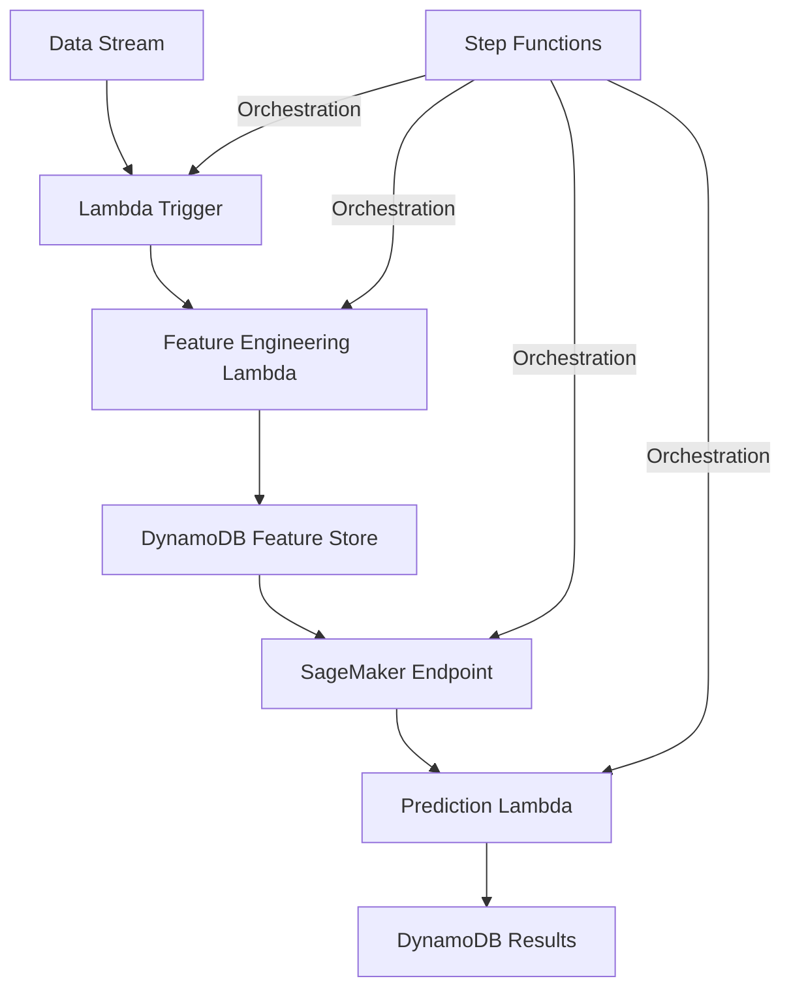

# Real-time ML Prediction Pipeline

## Project Overview

**Development Time: 10 Hours**

This project demonstrates a practical real-time prediction system that processes streaming data, applies machine learning models, and serves predictions through a serverless architecture.

The system is designed to ingest data streams, process them in real-time, apply feature engineering, make predictions using pre-trained XGBoost models, and store the results for downstream applications. The entire workflow is orchestrated through AWS Step Functions, with individual components deployed as serverless Lambda functions or SageMaker endpoints.

## Development Timeline

| Phase | Time Estimate | Description |
|-------|---------------|-------------|
| Infrastructure Setup | 2 hours | Setting up AWS resources with CloudFormation/CDK |
| Data Ingestion & Feature Engineering | 3 hours | Implementing Lambda functions for data processing |
| Model Deployment | 2 hours | Setting up SageMaker endpoint with XGBoost |
| Integration & Orchestration | 2 hours | Connecting components with Step Functions |
| Testing & Monitoring | 1 hour | Setting up basic testing and monitoring |

## Architecture




## Technology Stack

### AWS Services
- **AWS Lambda**: Serverless functions for data processing, feature engineering, and prediction formatting
- **AWS SageMaker**: Managed ML service for model training and inference
- **AWS DynamoDB**: NoSQL database for storing feature vectors and prediction results
- **AWS Step Functions**: Workflow orchestration for the prediction pipeline
- **AWS CloudWatch**: Basic monitoring and alerting

### ML Technologies
- **XGBoost**: Gradient boosting algorithm for predictive modeling
- **Feature Engineering Pipeline**: Basic transformations for raw input data

### Development & Testing
- **LocalStack**: Local AWS service emulation for development
- **Docker**: Containerization for consistent environments
- **Pytest**: Testing framework for unit tests

## Core Components

### 1. Data Ingestion Layer
- Lambda function triggered by data streams
- Basic data validation and preprocessing

### 2. Feature Engineering Pipeline
- Lambda function for transforming raw data into features
- Storage of feature vectors in DynamoDB

### 3. ML Inference Layer
- SageMaker hosted endpoint running XGBoost model
- Real-time prediction capabilities

### 4. Results Processing
- Lambda function for post-processing predictions
- Storage of final results in DynamoDB

### 5. Orchestration Layer
- Step Functions workflow definition
- Basic error handling and retry logic

## Local Development Setup

### Prerequisites
- Python 3.8+
- Docker and Docker Compose
- AWS CLI configured with appropriate credentials

### Installation

1. Clone the repository:
```bash
git clone <repository-url>
cd project1-ml-prediction-pipeline
```

2. Set up the local environment:
```bash
python -m venv venv
source venv/bin/activate  # On Windows: venv\Scripts\activate
pip install -r requirements.txt
```

3. Start LocalStack for AWS service emulation:
```bash
docker-compose up -d localstack
```

4. Initialize local DynamoDB tables:
```bash
python scripts/init_dynamodb.py
```

5. Deploy the local development stack:
```bash
python scripts/deploy_local.py
```

## Running the Pipeline Locally

1. Start the local development environment:
```bash
./scripts/start_local.sh
```

2. Send test data to the pipeline:
```bash
python scripts/send_test_data.py --input-file test_data.json
```

3. Check the results in the local DynamoDB:
```bash
python scripts/query_results.py
```

## Deployment to AWS

### Deployment with AWS CDK

1. Install AWS CDK:
```bash
npm install -g aws-cdk
```

2. Bootstrap CDK (first-time only):
```bash
cdk bootstrap
```

3. Deploy the stack:
```bash
cdk deploy
```

### Manual Deployment

Basic steps for manual deployment of each component:

1. Create DynamoDB tables for features and results
2. Deploy pre-trained model to SageMaker
3. Create Lambda functions for each step
4. Configure Step Functions workflow

## Testing

Run the basic test suite:
```bash
pytest
```

Integration tests:
```bash
pytest tests/integration/
```

## Monitoring and Operations

- CloudWatch dashboards for basic pipeline health
- Simple alarms for error rates and latency

## Future Enhancements

1. Add A/B testing capability for model deployment
2. Implement feature store with Amazon Feature Store
3. Add explainability with SHAP values
4. Enhance the monitoring with custom metrics

## Project Structure

```
project1-ml-prediction-pipeline/
├── cdk/                        # AWS CDK deployment code
├── data/                       # Sample data and schemas
├── docs/                       # Documentation
├── lambda/                     # Lambda function code
│   ├── feature_engineering/    # Feature transformation code
│   ├── prediction_handler/     # Prediction formatting code
│   └── trigger/                # Trigger function code
├── model/                      # Model code
│   ├── training/               # Training scripts
│   └── artifacts/              # Model artifacts
├── scripts/                    # Utility scripts
├── step_functions/             # Step Functions workflow definitions
├── tests/                      # Test code
├── docker-compose.yml          # Local development services
├── requirements.txt            # Python dependencies
└── README.md                   # This file
```

## License

This project is licensed under the MIT License - see the LICENSE file for details.

## Contributors

- [Your Name] - Initial work

## Acknowledgments

- AWS Documentation
- XGBoost Documentation
