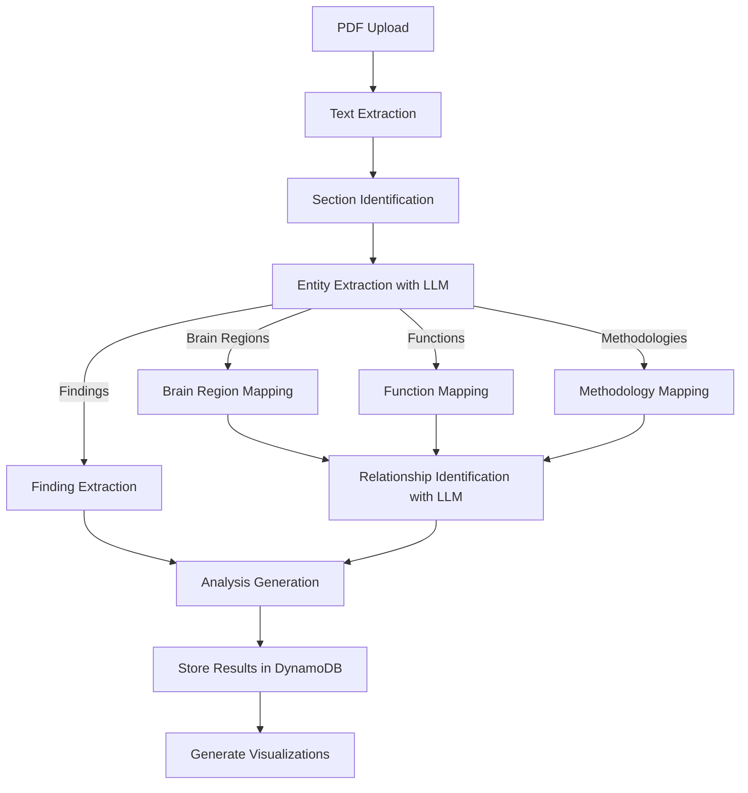
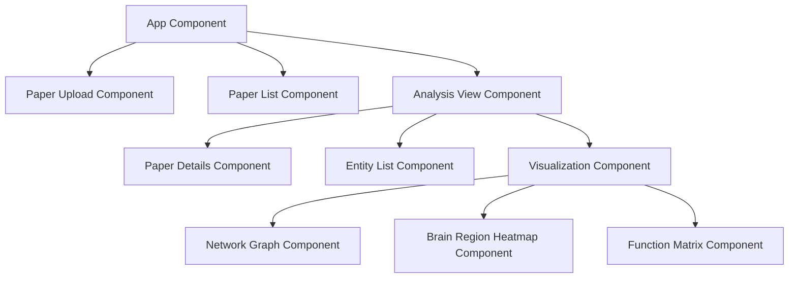
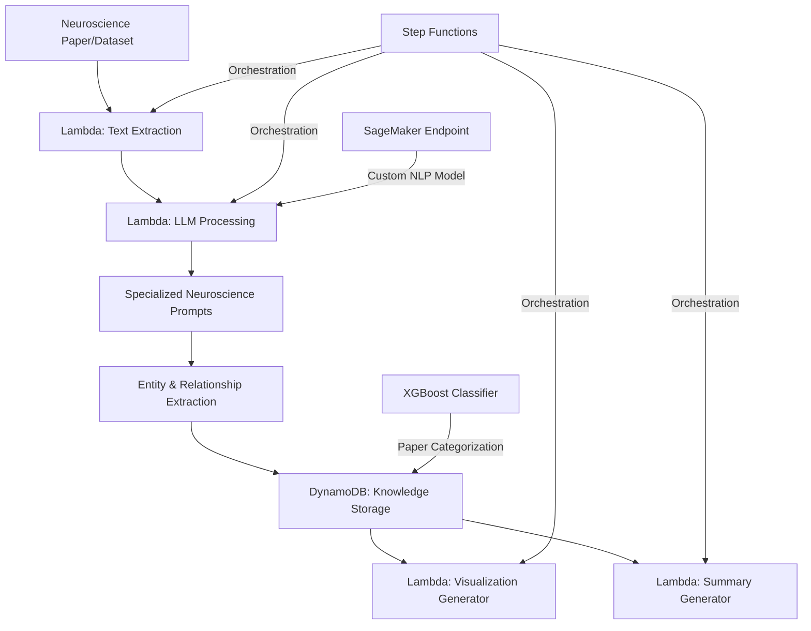
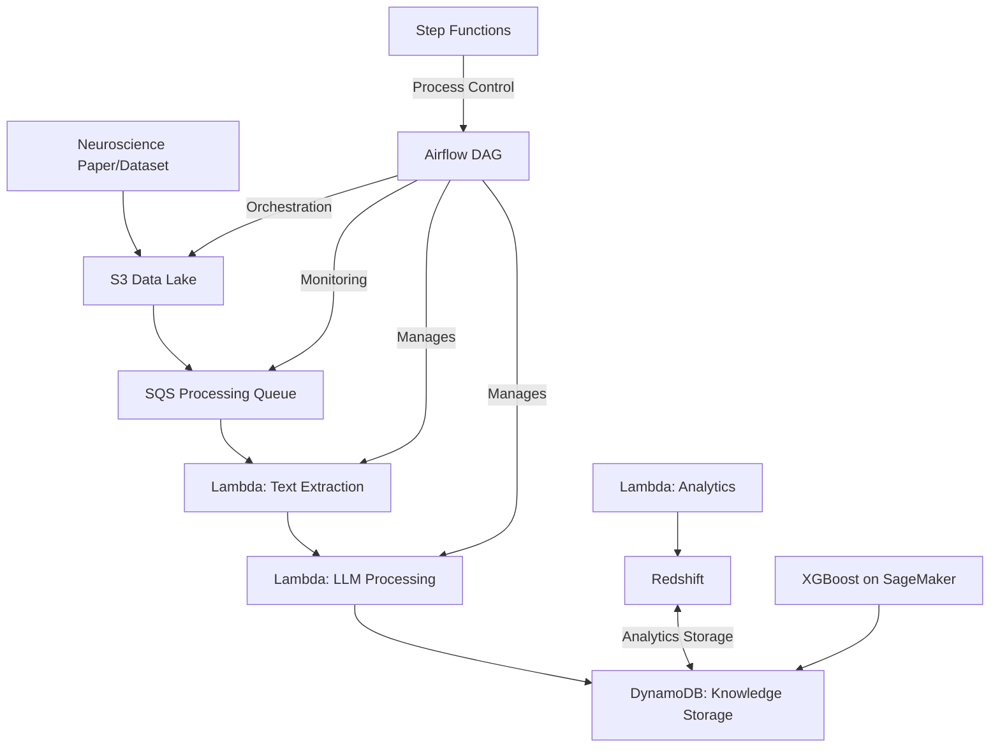

# NeuroText Analyzer

## Table of Contents

- [Project Overview](#project-overview)
- [Phased Learning Roadmap](#phased-learning-roadmap)
  - [Phase 1: Core Paper Analysis Foundation](#phase-1-core-paper-analysis-foundation-3-4-hours)
  - [Phase 2: Enhanced Analysis & AWS Integration](#phase-2-enhanced-analysis--aws-integration-3-4-hours)
  - [Phase 3: Advanced Features & ML Integration](#phase-3-advanced-features--ml-integration-3-4-hours)
- [Development Timeline](#development-timeline)
- [Deep Dive: Data Design for NeuroText Analyzer](#deep-dive-data-design-for-neurotext-analyzer)
  - [Core Data Models (Go Structs)](#1-core-data-models-go-structs)
  - [Database Schema (DynamoDB)](#2-database-schema-dynamodb)
  - [Data Processing Pipeline](#3-data-processing-pipeline)
  - [LLM Prompting Strategy for Data Extraction](#4-llm-prompting-strategy-for-data-extraction)
  - [API Contract](#5-api-contract)
  - [Data for Visualizations](#6-data-for-visualizations)
  - [Storage Design for Files](#7-storage-design-for-files)
  - [React Component Data Flow](#8-react-component-data-flow)
  - [Sample Visualization Data Flow](#9-sample-visualization-data-flow)
  - [Data Evolution Considerations](#10-data-evolution-considerations)
- [Architecture](#architecture)
- [Technology Stack](#technology-stack)
- [Core Components](#core-components)
- [Use Cases](#use-cases)
- [Local Development Setup](#local-development-setup)
- [Deployment to AWS](#deployment-to-aws)
- [Project Structure](#project-structure)
- [Enhanced Architecture (Learning Extensions)](#enhanced-architecture-learning-extensions)
- [Future Enhancements](#future-enhancements)
- [Limitations](#limitations)
- [License](#license)
- [Acknowledgments](#acknowledgments)

## Project Overview

**Development Time: 10 Hours**

---

## Key Objectives (2025 Update)

- Upload neuroscience research papers (PDFs) with user highlights
- Automatically extract and visualize highlighted sections using LLMs and prompt engineering
- Generate ASCII/text-based visual abstractions of entire papers for quick review
- Auto-generate tags, categories, and summaries using AI
- Build a graph-based reference map connecting papers by tags, citations, and content similarity
- Serve as a personal neuroscience reading blog and knowledge base

---

## Phased Roadmap (2025 Blog)

## Deep Dive: Data Design for NeuroText Analyzer

### ASCII Visualization: Data Model Relationships

```
+-------------------+         +-------------------+
|      Paper        |<>-------|     Section       |
+-------------------+         +-------------------+
| ID                |         | ID                |
| Title             |         | PaperID           |
| Authors           |         | Title             |
| ...               |         | Type              |
| Sections[]        |         | Content           |
| Findings[]        |         +-------------------+
| Analysis          |
+-------------------+
        |
        | 1
        |        *
        v
+-------------------+
|    Finding        |
+-------------------+
| ID                |
| PaperID           |
| SectionID         |
| Description       |
| BrainRegions[]----+-------------------+
| Functions[]-------+---+               |
| Methodologies[]---+   |               |
| Confidence        |   |               |
+-------------------+   |               |
        |               |               |
        |               |               |
        v               v               v
+-------------+   +-------------+   +-------------+
| BrainRegion |   |  Function   |   | Methodology |
+-------------+   +-------------+   +-------------+
| ID          |   | ID          |   | ID          |
| Name        |   | Name        |   | Name        |
| ...         |   | ...         |   | ...         |
+-------------+   +-------------+   +-------------+

        ^
        |
        | (Many-to-many via IDs)
        |
+-------------------+
|   Relationship    |
+-------------------+
| ID                |
| SourceType        |
| SourceID          |
| TargetType        |
| TargetID          |
| Type              |
| Description       |
| Strength          |
| PaperIDs[]        |
+-------------------+

        ^
        |
        | 1
        |        1
        v        v
+-------------------+
|    Analysis       |
+-------------------+
| ID                |
| PaperID           |
| Summary           |
| KeyFindings[]     |
| BrainRegions[]    |
| Functions[]       |
| Methodologies[]   |
| CompletedAt       |
+-------------------+
```

### 1. Core Data Models (Go Structs)

```go
// Paper represents a scientific paper being analyzed
type Paper struct {
    ID          string    `json:"id" dynamodbav:"id"`
    Title       string    `json:"title" dynamodbav:"title"`
    Authors     []string  `json:"authors" dynamodbav:"authors"`
    PublishDate time.Time `json:"publishDate" dynamodbav:"publishDate"`
    Journal     string    `json:"journal" dynamodbav:"journal"`
    UploadedAt  time.Time `json:"uploadedAt" dynamodbav:"uploadedAt"`
    Status      string    `json:"status" dynamodbav:"status"` // processing, completed, failed
    RawTextPath string    `json:"rawTextPath" dynamodbav:"rawTextPath"`
    Sections    []Section `json:"sections" dynamodbav:"sections"`
}

// Section represents a logical section of a paper
type Section struct {
    ID      string `json:"id" dynamodbav:"id"`
    PaperID string `json:"paperId" dynamodbav:"paperId"`
    Title   string `json:"title" dynamodbav:"title"`
    Type    string `json:"type" dynamodbav:"type"` // abstract, introduction, methods, results, discussion, etc.
    Content string `json:"content" dynamodbav:"content"`
    Order   int    `json:"order" dynamodbav:"order"`
}

// BrainRegion represents a brain area mentioned in a paper
type BrainRegion struct {
    ID          string   `json:"id" dynamodbav:"id"`
    Name        string   `json:"name" dynamodbav:"name"`
    Aliases     []string `json:"aliases" dynamodbav:"aliases"`
    Description string   `json:"description" dynamodbav:"description"`
    ParentID    string   `json:"parentId" dynamodbav:"parentId"` // For hierarchical relationships
}

// Function represents a neurological function or process
type Function struct {
    ID          string   `json:"id" dynamodbav:"id"`
    Name        string   `json:"name" dynamodbav:"name"`
    Description string   `json:"description" dynamodbav:"description"`
    Categories  []string `json:"categories" dynamodbav:"categories"`
}

// Methodology represents a research method mentioned in papers
type Methodology struct {
    ID          string   `json:"id" dynamodbav:"id"`
    Name        string   `json:"name" dynamodbav:"name"`
    Description string   `json:"description" dynamodbav:"description"`
    Categories  []string `json:"categories" dynamodbav:"categories"`
}

// Finding represents a scientific finding extracted from a paper
type Finding struct {
    ID            string    `json:"id" dynamodbav:"id"`
    PaperID       string    `json:"paperId" dynamodbav:"paperId"`
    Description   string    `json:"description" dynamodbav:"description"`
    SectionID     string    `json:"sectionId" dynamodbav:"sectionId"`
    BrainRegions  []string  `json:"brainRegions" dynamodbav:"brainRegions"`
    Functions     []string  `json:"functions" dynamodbav:"functions"`
    Methodologies []string  `json:"methodologies" dynamodbav:"methodologies"`
    Confidence    float64   `json:"confidence" dynamodbav:"confidence"`
    ExtractedAt   time.Time `json:"extractedAt" dynamodbav:"extractedAt"`
}

// Relationship represents a connection between entities
type Relationship struct {
    ID          string  `json:"id" dynamodbav:"id"`
    SourceType  string  `json:"sourceType" dynamodbav:"sourceType"` // BrainRegion, Function, Methodology
    SourceID    string  `json:"sourceId" dynamodbav:"sourceId"`
    TargetType  string  `json:"targetType" dynamodbav:"targetType"`
    TargetID    string  `json:"targetId" dynamodbav:"targetId"`
    Type        string  `json:"type" dynamodbav:"type"` // causes, correlates_with, part_of, etc.
    Description string  `json:"description" dynamodbav:"description"`
    Strength    float64 `json:"strength" dynamodbav:"strength"` // 0.0 to 1.0
    PaperIDs    []string `json:"paperIds" dynamodbav:"paperIds"` // Source papers for this relationship
}

// Analysis represents the complete analysis of a paper
type Analysis struct {
    ID            string    `json:"id" dynamodbav:"id"`
    PaperID       string    `json:"paperId" dynamodbav:"paperId"`
    Summary       string    `json:"summary" dynamodbav:"summary"`
    KeyFindings   []string  `json:"keyFindings" dynamodbav:"keyFindings"`
    BrainRegions  []string  `json:"brainRegions" dynamodbav:"brainRegions"`
    Functions     []string  `json:"functions" dynamodbav:"functions"`
    Methodologies []string  `json:"methodologies" dynamodbav:"methodologies"`
    CompletedAt   time.Time `json:"completedAt" dynamodbav:"completedAt"`
}
```

### 2. Database Schema (DynamoDB)

- **Papers Table**: Partition Key: `id` (UUID)
- **Sections Table**: Partition Key: `paperId` (UUID), Sort Key: `id` (UUID)
- **BrainRegions Table**: Partition Key: `id` (UUID)
- **Functions Table**: Partition Key: `id` (UUID)
- **Methodologies Table**: Partition Key: `id` (UUID)
- **Findings Table**: Partition Key: `paperId` (UUID), Sort Key: `id` (UUID)
- **Relationships Table**: Partition Key: `sourceType#sourceId` (Composite), Sort Key: `targetType#targetId` (Composite)
- **Analyses Table**: Partition Key: `paperId` (UUID)

### 3. Data Processing Pipeline



#### ASCII Visualization

```
+-------------------+
|   PDF Upload      |
+-------------------+
          |
          v
+-------------------+
| Text Extraction   |
+-------------------+
          |
          v
+---------------------------+
| Section Identification    |
+---------------------------+
          |
          v
+---------------------------+
| Entity Extraction (LLM)   |
+---------------------------+
   |      |      |      |
   v      v      v      v
Brain  Func  Meth  Findings
Reg.   tions odol.
 |      |      |      |
 +------+------+------+
          |
          v
+---------------------------+
| Relationship Identification|
+---------------------------+
          |
          v
+-------------------+
| Analysis Gen.     |
+-------------------+
          |
          v
+-------------------+
| Store in DynamoDB |
+-------------------+
          |
          v
+-------------------+
| Visualizations    |
+-------------------+
```

### 4. LLM Prompting Strategy for Data Extraction

```go
// Brain Region Extraction Prompt
const brainRegionPrompt = `
You are a neuroscience expert analyzing a research paper.
Extract all brain regions mentioned in the following text.
For each brain region, provide:
1. The exact name as mentioned in the text
2. Any aliases or alternative names mentioned
3. A brief description of its function (if available in the text)

Text: {{.Content}}

Respond in the following JSON format only:
{
  "brainRegions": [
    {
      "name": "string",
      "aliases": ["string"],
      "description": "string"
    }
  ]
}
`
```

### 5. API Contract

- **POST /api/papers**: Upload a new paper
- **GET /api/papers**: List all papers
- **GET /api/papers/:id**: Get paper details
- **GET /api/papers/:id/status**: Get processing status
- **DELETE /api/papers/:id**: Delete a paper
- **GET /api/papers/:id/analysis**: Get complete analysis
- **GET /api/papers/:id/brainregions**: Get brain regions
- **GET /api/papers/:id/functions**: Get functions
- **GET /api/papers/:id/methodologies**: Get methodologies
- **GET /api/papers/:id/findings**: Get findings
- **GET /api/papers/:id/relationships**: Get relationships
- **GET /api/brainregions**: List all brain regions
- **GET /api/brainregions/:id**: Get brain region details
- **GET /api/brainregions/:id/functions**: Get functions related to a brain region
- **GET /api/brainregions/:id/papers**: Get papers mentioning a brain region

### 6. Data for Visualizations

```go
type NetworkNode struct {
    ID    string `json:"id"`
    Name  string `json:"name"`
    Type  string `json:"type"`
    Size  int    `json:"size"`
    Group int    `json:"group"`
}

type NetworkLink struct {
    Source   string  `json:"source"`
    Target   string  `json:"target"`
    Type     string  `json:"type"`
    Strength float64 `json:"strength"`
}

type NetworkGraph struct {
    Nodes []NetworkNode `json:"nodes"`
    Links []NetworkLink `json:"links"`
}

type BrainRegionHeatmapData struct {
    RegionID   string  `json:"regionId"`
    RegionName string  `json:"regionName"`
    Intensity  float64 `json:"intensity"`
    X          float64 `json:"x"`
    Y          float64 `json:"y"`
    Z          float64 `json:"z"`
}

type MatrixCell struct {
    BrainRegionID string  `json:"brainRegionId"`
    FunctionID    string  `json:"functionId"`
    Strength      float64 `json:"strength"`
}

type MatrixData struct {
    BrainRegions []string    `json:"brainRegions"`
    Functions    []string    `json:"functions"`
    Cells        []MatrixCell `json:"cells"`
}
```

### 7. Storage Design for Files

```
/storage
  /papers
    /{paper-id}/
      - original.pdf
      - extracted_text.txt
      - metadata.json
      /sections/
        - abstract.txt
        - introduction.txt
        - methods.txt
        - results.txt
        - discussion.txt
      /analysis/
        - brain_regions.json
        - functions.json
        - methodologies.json
        - findings.json
        - relationships.json
        - complete_analysis.json
```

### 8. React Component Data Flow



#### ASCII Visualization

```
+-------------------+
|   App Component   |
+-------------------+
    |     |     |
    v     v     v
Upload  List  Analysis
Comp.   Comp. View Comp.
                |
                v
        +-------------------+
        |  Analysis View    |
        +-------------------+
         |     |      |
         v     v      v
   Details  Entity  Visualization
   Comp.    List    Comp.
                   |
                   v
        +-------------------+
        | Visualization     |
        +-------------------+
         |   |   |
         v   v   v
      Net  Heat  Matrix
      Graph Map  Comp.
```

### 9. Sample Visualization Data Flow

#### ASCII Visualization

```
[User]
   |
   v
[Select Paper]
   |
   v
[Frontend] --(GET /api/papers/:id/relationships)--> [Backend]
   |
   v
[Receive Relationship Data]
   |
   v
[Transform to NetworkGraph Format]
   |
   v
[Render Visualization (D3.js, etc.)]
```

1. User selects a paper
2. Frontend requests `/api/papers/:id/relationships`
3. Backend returns relationship data
4. Frontend transforms this data into the NetworkGraph format
5. Visualization component renders the network using D3.js or similar

### 10. Data Evolution Considerations

- **Phase 1**: Focus on Paper, Section, and basic Analysis models
- **Phase 2**: Add BrainRegion, Function, Methodology, Finding, and Relationship models
- **Phase 3**: Extend with more specialized data structures for ML and visualization

---

## Development Timeline

| Phase | Time Estimate | Description |
|-------|---------------|-------------|
| LLM Integration | 2 hours | Setting up OpenAI API or local Llama model integration |
| AWS Infrastructure | 1 hour | Setting up Lambda, DynamoDB, and Step Functions |
| Prompt Engineering | 2 hours | Developing specialized prompts for neuroscience text analysis |
| Data Processing Pipeline | 2 hours | Creating text extraction and preprocessing pipeline |
| ML Feature Development | 1 hour | Implementing XGBoost for paper classification |
| Visualization | 1 hour | Implementing basic visualization of relationships |
| Web Interface | 1 hour | Building a simple interface for paper analysis |

---

## Architecture



---

## Technology Stack

### Backend (Go)
- Web Framework: Gin, Echo, or Fiber
- PDF Processing: rsc.io/pdf or github.com/unidoc/unipdf
- OpenAI Integration: Official Go client or LangChainGo
- Logging: logrus or zap
- Database: DynamoDB (AWS SDK for Go)
- AWS SDK: Lambda, Step Functions

### Frontend (React)
- UI Framework: Material-UI, Chakra UI, or Ant Design
- State Management: Redux, Context API, or Zustand
- Visualization Libraries: D3.js, Plotly.js, or React-Vis
- API Client: Axios, Fetch API, or React Query
- PDF Viewer: React-pdf or similar

### DevOps/Infrastructure
- Docker setup for Go and React
- AWS deployment (ECS, EKS, Lambda)
- CI/CD: GitHub Actions or AWS CodePipeline
- LocalStack for local AWS emulation

### Additional Data & Analytics Technologies

- **Cassandra:** Distributed NoSQL database for high-volume, scalable storage of paper data and time-series analytics.
- **PostgreSQL:** Relational database for structured neuroscience data, advanced queries, and transactional integrity.
- **TAO (Graph Database):** Native graph database for modeling and querying complex relationships between brain regions, functions, and research findings.
- **Data Warehouse (Hive, ORC):** Scalable analytics and historical trend analysis using columnar storage and big data processing.
- **Scuba:** Real-time analytics and ad-hoc querying for monitoring pipelines, system performance, and interactive dashboards.

---

## Core Components

### 1. Paper Ingestion System
- PDF and text file processing via Lambda function
- Metadata extraction (authors, publication date, journal)
- Section identification (abstract, methods, results, discussion)
- S3 storage for raw and processed documents

### 2. Neuroscience-Specialized Prompts
- Custom prompt templates focusing on brain regions
- Prompts designed to extract methodologies
- Templates for finding neural correlates and functions
- Stored and versioned in DynamoDB

### 3. Entity Extraction Engine
- Identification of brain regions and structures
- Recognition of research methodologies (EEG, fMRI, etc.)
- Extraction of findings and correlations
- XGBoost classification of papers by research domain

### 4. Relationship Mapping
- Brain region-to-function connections
- Methodology-to-finding relationships
- Knowledge graph construction in DynamoDB
- Step Functions for coordinating the mapping process

### 5. Visualization Dashboard
- Interactive brain region highlighting
- Relationship network visualization
- Finding summary cards
- Serverless architecture using Lambda and API Gateway

---

## Use Cases

### 1. Research Paper Analysis
```
Input: "Recent fMRI studies suggest that the hippocampus plays a crucial role in spatial memory formation, while the amygdala processes emotional responses."

Output:
- Brain Regions: hippocampus, amygdala
- Functions: spatial memory formation, emotional response processing
- Methodology: fMRI studies
- Relationship Map: hippocampus → spatial memory, amygdala → emotional responses
```

### 2. Dataset Summary Generation
```
Input: Dataset with multiple EEG recordings examining attention and working memory

Output:
- Comprehensive summary of key findings
- Patterns across multiple studies
- Areas of consensus and disagreement
- Visual representation of key relationships
```

### 3. Teaching Aid
```
Input: "Explain the role of the cerebellum in motor coordination"

Output:
- Detailed explanation with latest research findings
- Visual representation of cerebellum connections
- Key studies and their methodologies
- Simplified explanation for educational purposes
```

---

## Local Development Setup

### Prerequisites
- Go 1.20+
- Docker and Docker Compose
- AWS CLI configured with appropriate credentials
- OpenAI API key or local LLM setup

### Installation

1. Clone the repository:
```bash
git clone <repository-url>
cd project1-neurotext-analyzer
```

2. Set up the Go backend:
```bash
cd BackEnd
go mod init neurotext-analyzer
go get github.com/gin-gonic/gin
go get github.com/unidoc/unipdf/v3 # or rsc.io/pdf
go get github.com/sashabaranov/go-openai # or official OpenAI Go client
go get github.com/aws/aws-sdk-go-v2
```

3. Start the Go backend server:
```bash
go run main.go
```
The server will start on port 8080 by default.

4. Start LocalStack for AWS service emulation:
```bash
docker-compose up -d localstack
```

5. Configure API keys:
```bash
cp .env.example .env
# Edit .env with your API keys
```

6. Initialize local DynamoDB tables (if needed, using Go or AWS CLI):
```bash
# Example using AWS CLI
aws dynamodb create-table --cli-input-json file://dynamodb-table.json --endpoint-url http://localhost:4566
```

---

## Deployment to AWS

### Infrastructure as Code Deployment

1. Deploy using AWS CDK:
```bash
cd infrastructure
npm install
cdk deploy
```

### Serverless Deployment

1. Deploy using Serverless Framework:
```bash
serverless deploy --stage prod
```

---

## Project Structure

```
project1-neurotext-analyzer/
├── BackEnd/                # Go backend source code
│   ├── main.go             # Main application entry point (Gin server)
│   ├── go.mod              # Go module definition
│   ├── handlers/           # API route handlers (planned)
│   ├── models/             # Go data models (structs)
│   ├── services/           # Business logic and integrations
│   ├── config/             # Configuration files
│   └── utils/              # Utility functions
├── infrastructure/         # AWS CDK/CloudFormation code
├── serverless.yml          # Serverless Framework configuration
├── config/                 # Configuration files
│   └── prompt_templates/   # Neuroscience-specific prompts
├── data/                   # Sample papers and datasets
│   ├── papers/             # Example research papers
│   └── processed/          # Processed outputs
├── lambda/                 # Lambda function code (legacy or for reference)
│   ├── extraction/         # Text extraction function
│   ├── processing/         # LLM processing function
│   ├── visualization/      # Visualization generation function
│   └── summary/            # Summary generation function
├── models/                 # ML model definitions
│   ├── paper_classifier/   # XGBoost model for paper classification
│   └── entity_recognition/ # Custom NER models
├── processors/             # Text processing modules (legacy Python)
│   ├── extraction.py       # PDF and text extraction
│   ├── nlp.py              # NLP utilities
│   └── llm.py              # LLM interaction
├── visualizations/         # Visualization components
│   ├── brain_regions.py    # Brain region visualizer
│   └── networks.py         # Relationship network visualizer
├── tests/                  # Test modules
├── static/                 # Web assets
├── templates/              # Web interface templates
├── docker-compose.yml      # Docker composition for local development
└── README.md               # This file
```

---

## Enhanced Architecture (Learning Extensions)

This project has been extended with additional AWS services and data processing technologies to demonstrate a more comprehensive, production-ready architecture.

### Enhanced Architecture Diagram



---

### Additional Technology Stack

- **AWS SQS**: Manages document processing workloads with queues for incoming analysis requests and failure handling
- **AWS Redshift**: Data warehouse for storing and analyzing extracted neuroscience knowledge at scale
- **Apache Airflow**: Orchestrates complex document processing workflows with DAGs for pipeline management
- **Enhanced ML Pipeline**: Improved model deployment and management on SageMaker
- **Docker & Docker Compose**: Containerizes all services (web, ML, Airflow, LocalStack, Redshift emulation, etc.) for easy local development and deployment

---

### Docker Implementation

- Multi-stage Dockerfiles for optimized builds of each service (web, ML, Lambda, Airflow, etc.)
- Docker Compose configuration to spin up the entire stack locally, including LocalStack for AWS emulation, PostgreSQL for Redshift, and Airflow
- Volume mounts for persistent data and configuration
- Health checks for service monitoring
- GPU support for ML containers (if available)

---

## Future Enhancements

1. Integration with research paper databases (PubMed, etc.)
2. Advanced knowledge graph visualization
3. Comparison of findings across multiple papers
4. Citation network analysis
5. Fine-tuning on neuroscience-specific corpus using SageMaker
6. Auto-scaling Lambda functions for high-volume processing

---

## Limitations

- The analysis depends on the LLM's understanding of neuroscience concepts
- May not capture nuanced interpretations of complex findings
- Limited to text analysis (doesn't process images, graphs, or tables in papers)
- Not a replacement for expert human analysis

---

## License

This project is licensed under the MIT License - see the LICENSE file for details.

---

## Acknowledgments

- OpenAI/Meta for the foundation models
- The neuroscience research community
- Open-source NLP and visualization libraries
- AWS for cloud services
