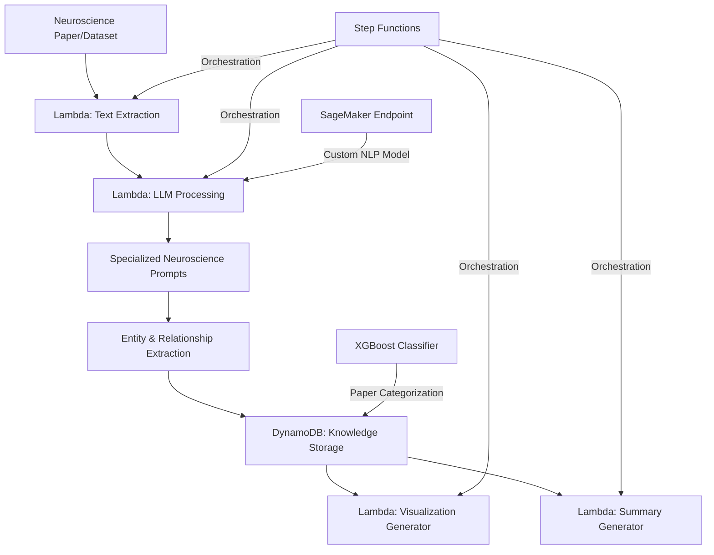

# NeuroText Analyzer

## Project Overview

**Development Time: 10 Hours**

This entry-level project combines LLMs with neuroscience by creating a specialized tool that analyzes neuroscience research papers and datasets. NeuroText Analyzer extracts key insights, findings, and relationships from neuroscience literature and presents them in an accessible format for researchers and students.

## Development Timeline

| Phase | Time Estimate | Description |
|-------|---------------|-------------|
| LLM Integration | 2 hours | Setting up OpenAI API or local Llama model integration |
| AWS Infrastructure | 1 hour | Setting up Lambda, DynamoDB, and Step Functions |
| Prompt Engineering | 2 hours | Developing specialized prompts for neuroscience text analysis |
| Data Processing Pipeline | 2 hours | Creating text extraction and preprocessing pipeline |
| ML Feature Development | 1 hour | Implementing XGBoost for paper classification |
| Visualization | 1 hour | Implementing basic visualization of relationships |
| Web Interface | 1 hour | Building a simple interface for paper analysis |

## Architecture



## Technology Stack

### AWS Services
- **AWS Lambda**: Serverless functions for text extraction, processing, and analysis
- **AWS DynamoDB**: NoSQL database for storing entities, relationships, and insights
- **AWS Step Functions**: Workflow orchestration for the analysis pipeline
- **AWS SageMaker**: Hosting custom NLP models fine-tuned for neuroscience
- **AWS API Gateway**: REST API endpoints for the web interface

### LLM Technologies
- **OpenAI API/Llama**: Foundation model for text understanding and analysis
- **Specialized Prompt Templates**: Custom prompts designed for neuroscience domain
- **Langchain**: Framework for chaining LLM operations together

### ML & Data Processing
- **XGBoost**: Classification of papers into neuroscience subdomains
- **PyPDF2/PDFMiner**: Extraction of text from research papers
- **NLTK/spaCy**: NLP processing for entity recognition
- **Pandas**: Data organization and manipulation
- **MLflow**: Tracking performance of prompt templates and extraction methods

### Development & Deployment
- **Docker**: Containerization for consistent environments
- **LocalStack**: Local AWS service emulation for development
- **GitHub Actions**: CI/CD pipeline for deployment

### Visualization & Interface
- **Plotly/D3.js**: Interactive visualization of relationships
- **Flask/Streamlit**: Simple web interface
- **Bootstrap**: Basic styling for the web interface

## Core Components

### 1. Paper Ingestion System
- PDF and text file processing via Lambda function
- Metadata extraction (authors, publication date, journal)
- Section identification (abstract, methods, results, discussion)
- S3 storage for raw and processed documents

### 2. Neuroscience-Specialized Prompts
- Custom prompt templates focusing on brain regions
- Prompts designed to extract methodologies
- Templates for finding neural correlates and functions
- Stored and versioned in DynamoDB

### 3. Entity Extraction Engine
- Identification of brain regions and structures
- Recognition of research methodologies (EEG, fMRI, etc.)
- Extraction of findings and correlations
- XGBoost classification of papers by research domain

### 4. Relationship Mapping
- Brain region-to-function connections
- Methodology-to-finding relationships
- Knowledge graph construction in DynamoDB
- Step Functions for coordinating the mapping process

### 5. Visualization Dashboard
- Interactive brain region highlighting
- Relationship network visualization
- Finding summary cards
- Serverless architecture using Lambda and API Gateway

## Use Cases

### 1. Research Paper Analysis
```
Input: "Recent fMRI studies suggest that the hippocampus plays a crucial role in spatial memory formation, while the amygdala processes emotional responses."

Output:
- Brain Regions: hippocampus, amygdala
- Functions: spatial memory formation, emotional response processing
- Methodology: fMRI studies
- Relationship Map: hippocampus → spatial memory, amygdala → emotional responses
```

### 2. Dataset Summary Generation
```
Input: Dataset with multiple EEG recordings examining attention and working memory

Output:
- Comprehensive summary of key findings
- Patterns across multiple studies
- Areas of consensus and disagreement
- Visual representation of key relationships
```

### 3. Teaching Aid
```
Input: "Explain the role of the cerebellum in motor coordination"

Output:
- Detailed explanation with latest research findings
- Visual representation of cerebellum connections
- Key studies and their methodologies
- Simplified explanation for educational purposes
```

## Local Development Setup

### Prerequisites
- Python 3.8+
- Docker and Docker Compose
- AWS CLI configured with appropriate credentials
- OpenAI API key or local LLM setup

### Installation

1. Clone the repository:
```bash
git clone <repository-url>
cd project1-neurotext-analyzer
```

2. Set up the local environment:
```bash
python -m venv venv
source venv/bin/activate  # On Windows: venv\Scripts\activate
pip install -r requirements.txt
```

3. Start LocalStack for AWS service emulation:
```bash
docker-compose up -d localstack
```

4. Configure API keys:
```bash
cp .env.example .env
# Edit .env with your API keys
```

5. Initialize local DynamoDB tables:
```bash
python scripts/init_dynamodb.py
```

6. Run the application:
```bash
python app.py
```

## Deployment to AWS

### Infrastructure as Code Deployment

1. Deploy using AWS CDK:
```bash
cd infrastructure
npm install
cdk deploy
```

### Serverless Deployment

1. Deploy using Serverless Framework:
```bash
serverless deploy --stage prod
```

## Project Structure

```
project1-neurotext-analyzer/
├── app.py                  # Main application entry point
├── infrastructure/         # AWS CDK/CloudFormation code
├── serverless.yml          # Serverless Framework configuration
├── config/                 # Configuration files
│   └── prompt_templates/   # Neuroscience-specific prompts
├── data/                   # Sample papers and datasets
│   ├── papers/             # Example research papers
│   └── processed/          # Processed outputs
├── lambda/                 # Lambda function code
│   ├── extraction/         # Text extraction function
│   ├── processing/         # LLM processing function
│   ├── visualization/      # Visualization generation function
│   └── summary/            # Summary generation function
├── models/                 # ML model definitions
│   ├── paper_classifier/   # XGBoost model for paper classification
│   └── entity_recognition/ # Custom NER models
├── processors/             # Text processing modules
│   ├── extraction.py       # PDF and text extraction
│   ├── nlp.py              # NLP utilities
│   └── llm.py              # LLM interaction
├── visualizations/         # Visualization components
│   ├── brain_regions.py    # Brain region visualizer
│   └── networks.py         # Relationship network visualizer
├── tests/                  # Test modules
├── static/                 # Web assets
├── templates/              # Web interface templates
├── docker-compose.yml      # Docker composition for local development
├── requirements.txt        # Python dependencies
└── README.md               # This file
```

## Future Enhancements

1. Integration with research paper databases (PubMed, etc.)
2. Advanced knowledge graph visualization
3. Comparison of findings across multiple papers
4. Citation network analysis
5. Fine-tuning on neuroscience-specific corpus using SageMaker
6. Auto-scaling Lambda functions for high-volume processing

## Limitations

- The analysis depends on the LLM's understanding of neuroscience concepts
- May not capture nuanced interpretations of complex findings
- Limited to text analysis (doesn't process images, graphs, or tables in papers)
- Not a replacement for expert human analysis

## License

This project is licensed under the MIT License - see the LICENSE file for details.

## Acknowledgments

- OpenAI/Meta for the foundation models
- The neuroscience research community
- Open-source NLP and visualization libraries
- AWS for cloud services
