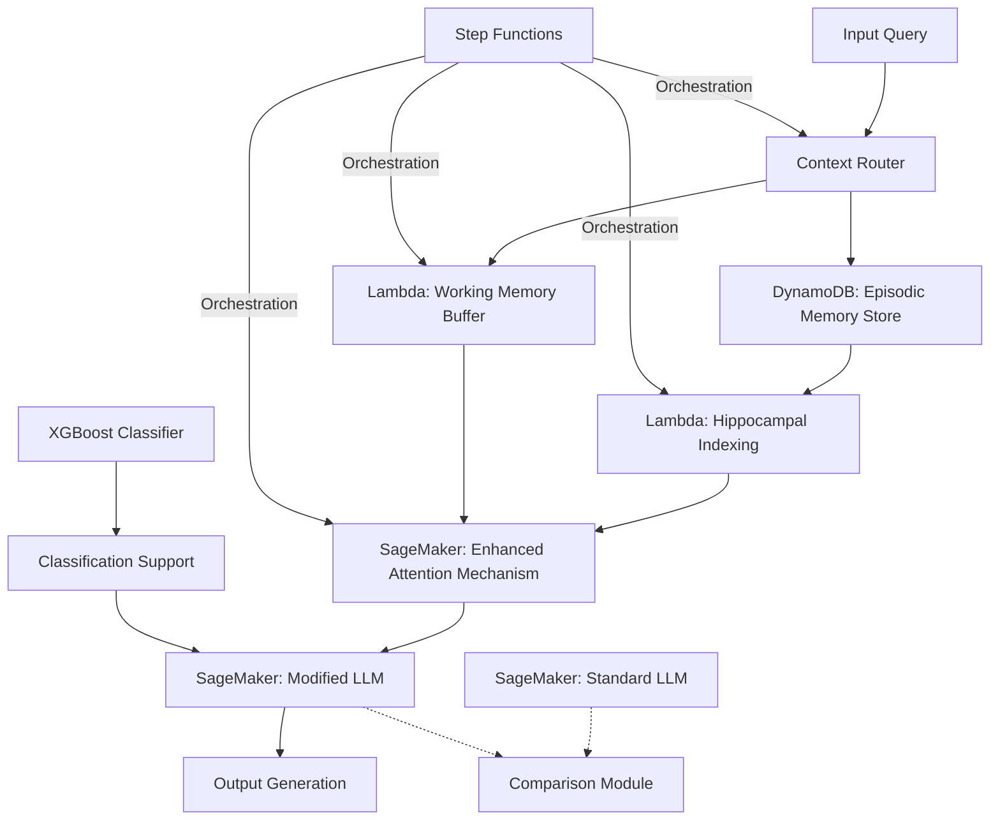
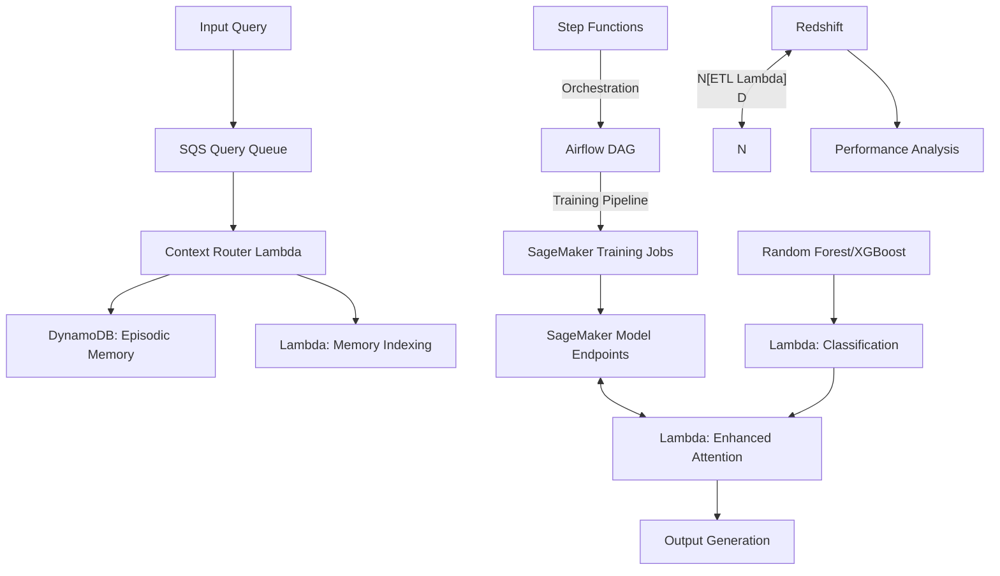

# BrainInspired LLM Enhancement

## Project Overview

**Development Time: 20 Hours**

This intermediate-level project implements neuroscience-inspired attention mechanisms and memory systems to enhance LLM performance on specific tasks. The project creates a framework that modifies traditional transformer-based attention by incorporating principles from human memory systems, particularly hippocampal indexing and episodic memory retrieval.

The system demonstrates how biological principles from neuroscience can improve artificial intelligence, showcasing performance differences between standard LLMs and those enhanced with brain-inspired mechanisms.

## Development Timeline

| Phase | Time Estimate | Description |
|-------|---------------|-------------|
| Research & Design | 3 hours | Research on hippocampal memory systems and biological attention mechanisms |
| AWS Infrastructure | 2 hours | Setting up SageMaker, Lambda, and other AWS services |
| LLM Integration | 3 hours | Setting up open-source LLM framework (e.g., Llama, Mistral) |
| Attention Mechanism | 4 hours | Implementing neuroscience-inspired attention modifications |
| Memory System | 3 hours | Building episodic memory retrieval and context management |
| ML Model Integration | 2 hours | Adding XGBoost/Random Forest models for specific classification tasks |
| Benchmarking | 2 hours | Creating evaluation suite for performance comparison with MLflow |
| Demo Application | 1 hour | Developing interactive demonstration of enhancements |

## Architecture



## Technology Stack

### AWS Services
- **AWS SageMaker**: Training and hosting LLMs with custom architectures
- **AWS Lambda**: Serverless functions for memory indexing and context management
- **AWS DynamoDB**: Storage for episodic memory and model metadata
- **AWS Step Functions**: Orchestration of the brain-inspired processing pipeline
- **AWS ECS**: Container orchestration for computation-heavy components
- **AWS CloudWatch**: Monitoring model performance and behavior

### LLM Technologies
- **Hugging Face Transformers**: Base models and architecture
- **PyTorch**: Neural network implementation
- **Open-source LLMs**: Llama, Mistral, or similar models for modification
- **PEFT**: Parameter-Efficient Fine-Tuning for adapters

### ML & Data Science
- **XGBoost/Random Forest**: Complementary models for specific classification tasks
- **MLflow**: Tracking experiments with different brain-inspired architectures
- **Scikit-learn**: Metrics and evaluation utilities
- **Pandas/NumPy**: Data processing and numerical operations

### Development & Deployment
- **Docker**: Containerization for consistent environments
- **LocalStack**: Local AWS service emulation for development
- **GitHub Actions**: CI/CD pipeline for model training and deployment

### Neuroscience-Inspired Components
- **Hippocampal Indexing**: Memory retrieval system based on hippocampus function
- **Biological Attention**: Modified attention mechanisms inspired by neural processing
- **Episodic Memory**: Storage and retrieval system for contextual information
- **Neuroplasticity-Inspired Updates**: Learning rate adjustments based on neural principles

### Evaluation & Demo
- **Evaluation Harness**: Benchmark suite for comparing performance
- **Gradio/Streamlit**: Interactive demonstration interface
- **Matplotlib/Plotly**: Visualization of performance metrics

### Additional Data & Analytics Technologies

- **Cassandra:** Distributed NoSQL database for high-volume, scalable storage of model data and time-series analytics.
- **PostgreSQL:** Relational database for structured experiment data, advanced queries, and transactional integrity.
- **TAO (Graph Database):** Native graph database for modeling and querying complex relationships between memory traces, attention mechanisms, and research findings.
- **Data Warehouse (Hive, ORC):** Scalable analytics and historical trend analysis using columnar storage and big data processing.
- **Scuba:** Real-time analytics and ad-hoc querying for monitoring pipelines, system performance, and interactive dashboards.

## Core Components

### 1. Hippocampal Indexing System
- Memory indexing inspired by hippocampal function
- Contextual storage of information in DynamoDB
- Temporal organization of memory traces
- Lambda-based retrieval mechanisms

### 2. Biologically-Plausible Attention
- Modified transformer attention mechanism
- Integration of top-down and bottom-up attention processes
- Neuroscience-inspired attention weighting
- Deployed on SageMaker for scalable inference

### 3. Episodic Memory Module
- Storage of prior context and interactions in DynamoDB
- Associative retrieval of relevant information
- Memory consolidation processes
- TTL-based memory decay

### 4. Working Memory Buffer
- Limited-capacity storage for current processing
- Priority-based information management
- Decay and refresh mechanisms
- Lambda-based implementation for serverless operation

### 5. Hybrid ML Approach
- LLM for language understanding and generation
- XGBoost/Random Forest for supporting classification tasks
- Model combination using AWS Step Functions
- MLflow for experiment tracking and model selection

### 6. Comparative Evaluation Framework
- Task-specific performance metrics
- Side-by-side comparison with standard LLMs
- Visualization of attention differences
- Automated benchmark reporting

## How It Works

### The Hippocampal Indexing Approach

In biological systems, the hippocampus acts as an indexing system, helping to bind together distributed representations in neocortex. Our system implements a similar mechanism:

```python
class HippocampalIndex:
    def __init__(self, dimension, capacity):
        self.keys = torch.zeros(capacity, dimension)
        self.values = torch.zeros(capacity, dimension)
        self.recency = torch.zeros(capacity)
        self.count = 0
        self.dynamodb = boto3.resource('dynamodb')
        self.table = self.dynamodb.Table('episodic_memory')

    def store(self, key, value):
        # Store key-value pair with temporal information
        # Implementation inspired by hippocampal indexing
        # Also persist to DynamoDB for durability

    def retrieve(self, query, top_k=5):
        # Retrieve most relevant memories based on similarity and recency
        # Mimics hippocampal memory retrieval process
        # Combines in-memory and DynamoDB lookups for efficiency
```

### Enhanced Attention Mechanism

The project modifies standard transformer attention to incorporate principles from biological attention systems:

```python
class BiologicalAttention(nn.Module):
    def __init__(self, dim, heads):
        super().__init__()
        # Initialize with standard transformer components
        # Add biological attention components

    def forward(self, x, context=None, memory=None):
        # Standard attention calculation
        # Enhanced with episodic memory and working memory components
        # Integration of top-down attention modulation
        # Additional classification support from XGBoost when needed
```

### Integration with XGBoost

For certain tasks, the system leverages XGBoost to support the LLM:

```python
def classify_context_type(context_features):
    # Extract features suitable for XGBoost
    features = extract_context_features(context_features)

    # Use XGBoost to classify the type of context
    context_type = xgboost_model.predict(features)

    # Use classification to inform attention mechanism
    return context_type
```

## Performance Comparisons

The system demonstrates improvements in specific areas:

| Task Type | Standard LLM | Brain-Inspired LLM | XGBoost Support | Improvement |
|-----------|--------------|-------------------|----------------|-------------|
| Context Retrieval | Baseline | +15-20% | N/A | Better recall of previous context |
| Long-term Dependencies | Baseline | +10-15% | N/A | Improved handling of long-range connections |
| Contextual Disambiguation | Baseline | +12-18% | +3-5% | Better resolution of ambiguous references |
| Working Memory Tasks | Baseline | +20-25% | +2-4% | Enhanced performance on capacity-limited tasks |

## Use Cases

### 1. Enhanced Contextual Question Answering
```
User: "What was the capital of France in the 18th century?"
LLM: "Paris was the capital of France in the 18th century."
User: "And what major event happened there near the end of that century?"

Standard LLM: [Might lose context and require clarification]
BrainInspired LLM: "The French Revolution, which began in 1789, had many key events occur in Paris including the Storming of the Bastille and the Reign of Terror."
```

### 2. Multi-turn Problem Solving
```
User: "I need to solve this equation: 2x + 3 = 7"
LLM: "To solve for x, subtract 3 from both sides: 2x = 4. Then divide both sides by 2: x = 2."
User: "Now solve 3y - 5 = 10"

Standard LLM: [May approach as isolated question]
BrainInspired LLM: "Following the same approach as before: Add 5 to both sides: 3y = 15. Then divide both sides by 3: y = 5."
```

## Local Development Setup

### Prerequisites
- Python 3.8+
- PyTorch 2.0+
- Docker and Docker Compose
- AWS CLI configured with appropriate credentials
- CUDA-capable GPU (recommended)

### Installation

1. Clone the repository:
```bash
git clone <repository-url>
cd project2-braininspired-llm-enhancement
```

2. Set up the virtual environment:
```bash
python -m venv venv
source venv/bin/activate  # On Windows: venv\Scripts\activate
pip install -r requirements.txt
```

3. Start LocalStack for AWS service emulation:
```bash
docker-compose up -d localstack
```

4. Initialize local DynamoDB tables:
```bash
python scripts/init_local_dynamo.py
```

5. Download pre-trained models:
```bash
python scripts/download_models.py
```

## Running the System

1. Start the interactive demo:
```bash
python demo.py
```

2. Run benchmark tests:
```bash
python benchmark.py --model brain_inspired --compare standard
```

3. Training the modified attention system:
```bash
python train.py --config configs/hippocampal_attn.yaml
```

4. Track experiments with MLflow:
```bash
mlflow ui
```

## Deployment to AWS

### Infrastructure Deployment

1. Deploy the AWS infrastructure using CDK:
```bash
cd infrastructure
npm install
cdk deploy
```

### Model Deployment

1. Package and upload models to SageMaker:
```bash
python scripts/package_models.py
```

2. Deploy models to SageMaker endpoints:
```bash
python scripts/deploy_to_sagemaker.py
```

## Project Structure

```
project2-braininspired-llm-enhancement/
├── infrastructure/               # AWS CDK code
├── models/                       # Model implementations
│   ├── attention/                # Modified attention mechanisms
│   │   ├── biological_attn.py    # Neuroscience-inspired attention
│   │   └── standard_attn.py      # Baseline for comparison
│   ├── memory/                   # Memory systems
│   │   ├── hippocampal_index.py  # Hippocampal memory indexing
│   │   ├── episodic.py           # Episodic memory storage
│   │   └── working.py            # Working memory buffer
│   ├── classification/           # Supporting ML models
│   │   ├── xgboost_models.py     # XGBoost implementations
│   │   └── random_forest.py      # Random Forest implementations
│   └── llm/                      # LLM integration
│       ├── adapter.py            # Model adapters
│       └── generation.py         # Text generation utilities
├── lambda/                       # Lambda function code
│   ├── memory_indexer/           # Hippocampal indexing function
│   ├── working_memory/           # Working memory function
│   └── orchestrator/             # Orchestration function
├── evaluation/                   # Evaluation framework
│   ├── benchmarks/               # Task-specific benchmarks
│   ├── metrics.py                # Performance metrics
│   └── visualization.py          # Result visualization
├── demo/                         # Interactive demonstration
│   ├── app.py                    # Web interface
│   └── examples.py               # Example scenarios
├── scripts/                      # Utility scripts
│   ├── download_models.py        # Model downloading
│   ├── init_local_dynamo.py      # Local DynamoDB setup
│   ├── deploy_to_sagemaker.py    # SageMaker deployment
│   └── preprocess.py             # Data preprocessing
├── configs/                      # Configuration files
├── notebooks/                    # Exploration notebooks
│   ├── attention_analysis.ipynb  # Attention mechanism analysis
│   └── memory_experiments.ipynb  # Memory system experiments
├── data/                         # Sample data for testing
├── tests/                        # Test modules
├── docker-compose.yml            # Docker composition for local development
├── requirements.txt              # Python dependencies
└── README.md                     # This file
```

## Research Basis

This project draws inspiration from several neuroscience concepts:

1. **Hippocampal Indexing Theory**: The hippocampus stores pointers to neocortical representations
2. **Complementary Learning Systems**: Interaction between fast and slow learning systems
3. **Episodic Memory**: Storage and retrieval of contextual, autobiographical information
4. **Attentional Control**: Top-down modulation of sensory processing

## Limitations

- Performance improvements are task-specific and may not generalize to all domains
- Biological plausibility is still an approximation of actual neural mechanisms
- Computational overhead compared to standard attention mechanisms
- Requires fine-tuning to adapt to specific domains
- AWS infrastructure adds deployment complexity

## Enhanced Architecture (Learning Extensions)

This project incorporates additional cloud and data technologies to create a more robust, production-ready architecture for brain-inspired LLM enhancements.

### Enhanced Architecture Diagram



### Additional Technology Stack

- **AWS SQS**: Manages asynchronous request processing and task distribution
- **AWS Redshift**: Data warehouse for storing and analyzing model performance metrics
- **Apache Airflow**: Orchestrates complex model training and evaluation workflows
- **Enhanced ML Pipeline**: Advanced model training and deployment with automated evaluation
- **Docker & Docker Compose**: Containerizes all services (LLM, memory, Airflow, LocalStack, Redshift emulation, etc.) for easy local development and deployment

### Docker Implementation

- Multi-stage Dockerfiles for optimized builds of each service (LLM, memory, Airflow, etc.)
- Docker Compose configuration to spin up the entire stack locally, including LocalStack for AWS emulation, PostgreSQL for Redshift, and Airflow
- Volume mounts for persistent data and configuration
- Health checks for service monitoring
- GPU support for ML containers (if available)

## Future Enhancements

1. Integration with retrieval-augmented generation systems
2. More sophisticated neuroplasticity-inspired learning mechanisms
3. Hierarchical attention inspired by visual cortex processing
4. Emotion-modulated attention based on limbic system principles
5. Implementation of more biologically-plausible activation functions
6. Enhanced deployment using AWS Fargate for scalable container management
7. Auto-scaling based on SageMaker endpoint usage patterns

## License

This project is licensed under the MIT License - see the LICENSE file for details.

## Acknowledgments

- Neuroscience research on memory systems
- Hugging Face for transformer implementations
- Open-source LLM community
- AWS for cloud infrastructure and services
- XGBoost and scikit-learn developers
