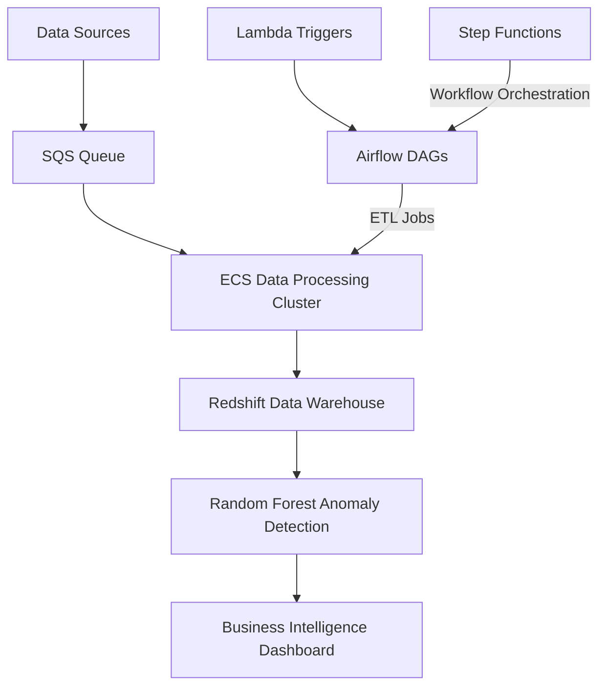

# Data Warehouse Analytics Platform

## Project Overview

**Development Time: 20 Hours**

This intermediate-to-advanced project implements an end-to-end data platform that ingests, processes, and analyzes datasets for business intelligence and analytics. The system leverages AWS cloud services and containerized processing to create a scalable data warehouse solution that transforms raw data into actionable insights.

The platform supports both batch and near real-time data processing, implementing ETL pipelines orchestrated by Apache Airflow. It includes anomaly detection capabilities powered by Random Forest algorithms and provides a comprehensive analytics layer for business intelligence applications.

## Development Timeline

| Phase | Time Estimate | Description |
|-------|---------------|-------------|
| Infrastructure Setup | 4 hours | Setting up AWS resources including ECS, Redshift, and SQS |
| Data Ingestion & Pipeline Development | 5 hours | Implementing data connectors and processing logic |
| Data Warehouse Implementation | 4 hours | Setting up Redshift schema and optimization |
| ETL Orchestration with Airflow | 3 hours | Creating DAGs and workflows |
| Anomaly Detection System | 2 hours | Implementing Random Forest models |
| Testing & Monitoring | 2 hours | Setting up tests and monitoring dashboards |

## Architecture




## Technology Stack

### AWS Services
- **Amazon ECS**: Container orchestration for scalable data processing
- **Amazon Redshift**: Data warehouse for analytics
- **Amazon SQS**: Message queuing for asynchronous processing
- **AWS Lambda**: Event-driven serverless computing
- **AWS Step Functions**: Workflow orchestration for ETL processes
- **AWS Glue**: Data catalog and metadata repository
- **AWS CloudWatch**: Monitoring and alerting

### Data Processing & Analytics
- **Apache Airflow**: Workflow orchestration and scheduling
- **Random Forest**: Machine learning algorithm for anomaly detection
- **SQL**: Analytics queries
- **Data Quality Framework**: Basic validation and monitoring

### Development & Testing
- **Docker**: Containerization of processing applications
- **LocalStack**: Local AWS service emulation
- **dbt (data build tool)**: Transformation layer for Redshift

## Core Components

### 1. Data Ingestion Layer
- Multiple source connectors (files, APIs, databases)
- SQS queuing for reliable message delivery
- Lambda triggers for event-based processing
- Basic data validation

### 2. Data Processing Layer
- ECS cluster for container execution
- Custom processing containers for different data types
- Error handling with dead-letter queues

### 3. Data Warehouse Layer
- Redshift cluster with distribution keys
- Star schema design for analytical queries
- Materialized views for common query patterns

### 4. ETL Orchestration
- Airflow DAGs for process coordination
- Step Functions for workflow logic
- Scheduling based on data dependencies

### 5. Analytics Layer
- Random Forest models for anomaly detection
- Aggregation and reporting views
- BI tool connectivity

### 6. Governance Layer
- Basic data lineage tracking
- Access control and security
- Audit logging

## Local Development Setup

### Prerequisites
- Python 3.8+
- Docker and Docker Compose
- AWS CLI configured with appropriate credentials
- PostgreSQL client (for local Redshift emulation)

### Installation

1. Clone the repository:
```bash
git clone <repository-url>
cd project2-data-warehouse-analytics
```

2. Set up the local environment:
```bash
python -m venv venv
source venv/bin/activate  # On Windows: venv\Scripts\activate
pip install -r requirements.txt
```

3. Start local development services:
```bash
docker-compose up -d
```

4. Initialize local Redshift schema:
```bash
python scripts/init_redshift_local.py
```

5. Start local Airflow instance:
```bash
./scripts/start_airflow.sh
```

## Running the Platform Locally

1. Load sample data:
```bash
python scripts/load_sample_data.py --source samples/retail_data.csv
```

2. Trigger the ETL pipeline:
```bash
python scripts/trigger_dag.py --dag-id retail_etl
```

3. Query the processed data:
```bash
python scripts/query_warehouse.py --query "SELECT * FROM retail_sales LIMIT 10"
```

4. Run anomaly detection:
```bash
python scripts/detect_anomalies.py --table retail_sales --date-column transaction_date
```

## Deployment to AWS

### Infrastructure as Code Deployment

1. Deploy using AWS CDK:
```bash
cd infrastructure
npm install
cdk deploy --all
```

### Container Deployment

1. Build and push the processing containers:
```bash
./scripts/build_and_push_containers.sh
```

2. Deploy Airflow to ECS:
```bash
./scripts/deploy_airflow.sh
```

## Data Modeling

The project implements a star schema design for the data warehouse:

- Fact tables: transactions, events, measurements
- Dimension tables: customers, products, time, location
- Slowly changing dimension handling for customer and product data

## ETL Workflows

The platform includes several key ETL workflows:

1. **Customer Data Processing**:
   - Deduplication
   - Address standardization
   - Customer segmentation

2. **Transaction Processing**:
   - Validation and enrichment
   - Currency conversion
   - Aggregation by time periods

3. **Product Catalog Updates**:
   - New product detection
   - Categorization
   - Hierarchy building

## Anomaly Detection

The Random Forest anomaly detection system:

- Identifies unusual patterns in sales data
- Detects potential fraud in transaction data
- Alerts on data quality issues

## Monitoring and Operations

- CloudWatch dashboards
- Data quality metrics
- Pipeline execution statistics
- Operational runbooks in `/docs/operations/`

## Future Enhancements

1. Implement real-time analytics with Kinesis
2. Add machine learning-based forecasting
3. Enhance self-service capabilities for business users
4. Implement data mesh architecture

## Project Structure

```
project2-data-warehouse-analytics/
├── .github/                  # CI/CD workflows
├── airflow/                  # Airflow DAG definitions
│   ├── dags/                 # ETL workflow definitions
│   ├── plugins/              # Custom Airflow plugins
│   └── sql/                  # SQL templates for transformations
├── containers/               # Docker containers for processing
│   ├── base/                 # Base container image
│   ├── python-processor/     # Python processing container
│   └── spark-processor/      # Spark processing container
├── data/                     # Sample data and schemas
├── dbt/                      # dbt models for Redshift
├── docs/                     # Documentation
│   ├── architecture/         # Architecture diagrams
│   ├── operations/           # Operational runbooks
│   └── user-guides/          # User guides
├── infrastructure/           # IaC with AWS CDK
├── machine_learning/         # Anomaly detection code
│   ├── models/               # Model definitions
│   ├── training/             # Training scripts
│   └── inference/            # Inference code
├── scripts/                  # Utility scripts
├── tests/                    # Test code
├── docker-compose.yml        # Local development services
├── requirements.txt          # Python dependencies
└── README.md                 # This file
```

## License

This project is licensed under the MIT License - see the LICENSE file for details.

## Contributors

- [Your Name] - Initial work

## Acknowledgments

- AWS Data Analytics Documentation
- Apache Airflow Community
- dbt Community
