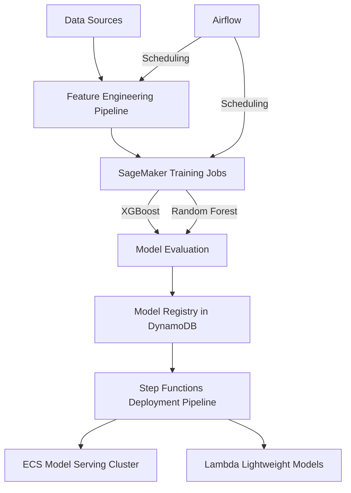

# Multi-model ML Platform with Automated Deployment

## Project Overview

**Development Time: 30 Hours**

This expert-level project implements a comprehensive platform for automated machine learning model training, evaluation, selection, and deployment with a focus on CI/CD practices. The platform manages the entire ML lifecycle, from data ingestion to model deployment, with a sophisticated orchestration system.

The system supports multiple model types (including XGBoost and Random Forest) that compete against each other, with automated selection of the best performing model for deployment. It features a robust infrastructure for model versioning, deployment pipeline automation, and serving at scale through both container-based and serverless approaches.

## Development Timeline

| Phase | Time Estimate | Description |
|-------|---------------|-------------|
| Infrastructure Setup | 6 hours | Setting up AWS resources including SageMaker, ECS, Lambda, and DynamoDB |
| Feature Engineering Pipeline | 5 hours | Building data validation, transformation, and feature selection systems |
| Model Training Framework | 5 hours | Implementing multi-model training with hyperparameter optimization |
| Model Evaluation & Registry | 4 hours | Creating evaluation framework and model versioning system |
| Deployment Pipeline | 5 hours | Building automated deployment with canary and blue/green strategies |
| CI/CD Integration | 3 hours | Setting up GitHub Actions and testing automation |
| Testing & Monitoring | 2 hours | Implementing comprehensive testing and monitoring systems |

## Architecture




## Technology Stack

### AWS Services
- **AWS SageMaker**: End-to-end ML platform for model training and evaluation
- **AWS Lambda**: Serverless computing for lightweight model inference
- **AWS Step Functions**: Workflow orchestration for ML pipelines
- **AWS DynamoDB**: NoSQL database for model metadata and versioning
- **AWS ECS**: Container orchestration for serving complex models
- **AWS CloudWatch**: Monitoring and observability

### ML Technologies
- **XGBoost**: Gradient boosting framework
- **Random Forest**: Ensemble learning method
- **Scikit-learn**: Machine learning library for evaluation metrics
- **MLflow**: Model tracking and registry
- **Hyperparameter Optimization**: Bayesian optimization with SageMaker

### Development & Testing
- **Docker**: Containerization for model training and serving
- **LocalStack**: Local AWS service emulation
- **Pytest**: Testing framework
- **GitHub Actions**: CI/CD pipeline

## Core Components

### 1. Feature Engineering Pipeline
- Data validation and cleaning
- Feature transformation and normalization
- Feature selection with statistical tests
- Feature store for reusable feature sets

### 2. Model Training System
- Parallel training of multiple model types
- Hyperparameter optimization
- Distributed training for large datasets
- Experiment tracking and versioning

### 3. Model Evaluation Framework
- Cross-validation strategy
- Custom evaluation metrics
- Statistical significance testing
- Model interpretability with SHAP values

### 4. Model Registry
- Version control for models
- Metadata storage in DynamoDB
- Model lineage tracking
- A/B test configuration

### 5. Deployment Pipeline
- Automated canary deployments
- Blue/green deployment strategy
- Rollback mechanisms
- Deployment approval workflow

### 6. Model Serving Infrastructure
- ECS for complex, resource-intensive models
- Lambda for lightweight, low-latency inference
- Auto-scaling based on traffic patterns
- Request batching for efficiency

## Local Development Setup

### Prerequisites
- Python 3.8+
- Docker and Docker Compose
- AWS CLI configured with appropriate credentials
- Git LFS for model storage

### Installation

1. Clone the repository:
```bash
git clone <repository-url>
cd project3-multi-model-ml-platform
```

2. Set up the local environment:
```bash
python -m venv venv
source venv/bin/activate  # On Windows: venv\Scripts\activate
pip install -r requirements.txt
```

3. Start local development services:
```bash
docker-compose up -d
```

4. Initialize local DynamoDB tables:
```bash
python scripts/init_local_dynamo.py
```

5. Set up local SageMaker:
```bash
./scripts/setup_local_sagemaker.sh
```

## Training and Deploying Models Locally

1. Prepare sample data:
```bash
python scripts/prepare_sample_data.py
```

2. Run the feature engineering pipeline:
```bash
python scripts/run_feature_engineering.py --config configs/local.yml
```

3. Train models:
```bash
python scripts/train_models.py --config configs/local.yml --models xgboost,random_forest
```

4. Evaluate and register models:
```bash
python scripts/evaluate_models.py --config configs/local.yml
```

5. Deploy the best model:
```bash
python scripts/deploy_model.py --config configs/local.yml --deployment-type local
```

6. Test the deployed model:
```bash
python scripts/test_model.py --endpoint http://localhost:8080/predict
```

## Deployment to AWS

### Infrastructure Deployment

1. Deploy the infrastructure using AWS CDK:
```bash
cd infrastructure
npm install
cdk deploy --all
```

### CI/CD Pipeline

The platform includes a complete CI/CD pipeline:

1. Commit code to the repository
2. GitHub Actions triggers the build pipeline
3. Tests are run and code is validated
4. New models are trained on sample data
5. Models are evaluated against benchmarks
6. If approved, models are deployed to staging
7. After validation, models are promoted to production

## Model Management

### Model Comparison

The platform automatically compares models based on:
- Accuracy metrics (RMSE, MAE, etc.)
- Inference latency
- Resource utilization
- Explainability scores
- Fairness metrics

### Model Versioning

Each model is versioned with:
- Training data snapshot identifier
- Feature engineering pipeline version
- Hyperparameters
- Dependencies and environment
- Performance metrics

## Monitoring and Operations

- Real-time model performance dashboards
- Drift detection for data and concept drift
- Automatic retraining triggers
- Alert system for performance degradation
- Operational runbooks in `/docs/operations/`

## Automated Experimentation

The platform supports automated experimentation:
- A/B testing infrastructure
- Feature impact analysis
- Hyperparameter sensitivity studies
- Model architecture exploration

## Future Enhancements

1. Add support for deep learning models
2. Implement federated learning capabilities
3. Enhanced fairness and bias detection
4. Automated documentation generation
5. Integration with feature stores like AWS Feature Store

## Project Structure

```
project3-multi-model-ml-platform/
├── .github/                    # CI/CD workflows
├── configs/                    # Configuration files
├── data/                       # Sample data and schemas
├── docs/                       # Documentation
│   ├── architecture/           # Architecture diagrams
│   ├── operations/             # Operational runbooks
│   └── api/                    # API documentation
├── feature_engineering/        # Feature pipeline code
│   ├── transformers/           # Custom transformers
│   ├── selectors/              # Feature selectors
│   └── validators/             # Data validators
├── infrastructure/             # IaC with AWS CDK
├── models/                     # Model definitions
│   ├── xgboost/                # XGBoost implementations
│   ├── random_forest/          # Random Forest implementations
│   └── common/                 # Shared model code
├── evaluation/                 # Evaluation framework
│   ├── metrics/                # Custom metrics
│   ├── visualizations/         # Performance visualizations
│   └── significance/           # Statistical testing
├── deployment/                 # Deployment code
│   ├── lambda/                 # Lambda deployment code
│   ├── ecs/                    # ECS deployment code
│   └── step_functions/         # Deployment workflows
├── serving/                    # Model serving code
│   ├── api/                    # API definitions
│   ├── containers/             # Serving containers
│   └── preprocessing/          # Request preprocessing
├── monitoring/                 # Monitoring code
│   ├── dashboards/             # CloudWatch dashboards
│   ├── drift_detection/        # Data drift detection
│   └── alerts/                 # Alert definitions
├── scripts/                    # Utility scripts
├── tests/                      # Test code
│   ├── unit/                   # Unit tests
│   ├── integration/            # Integration tests
│   └── performance/            # Performance tests
├── docker-compose.yml          # Local development services
├── requirements.txt            # Python dependencies
├── setup.py                    # Package setup
└── README.md                   # This file
```

## License

This project is licensed under the MIT License - see the LICENSE file for details.

## Contributors

- [Your Name] - Initial work

## Acknowledgments

- AWS ML Documentation
- SageMaker team
- Open-source ML community
