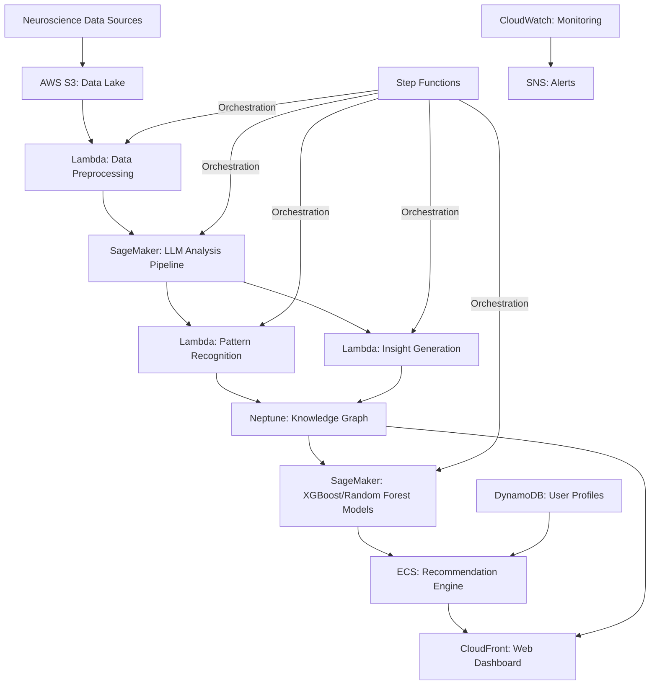
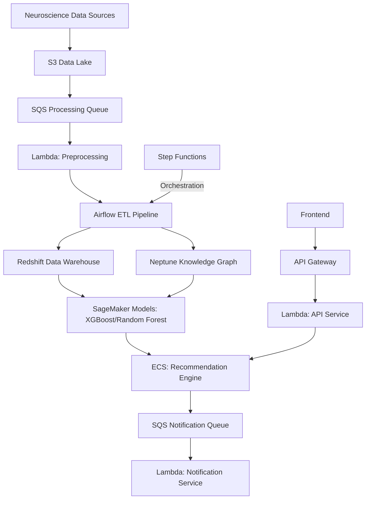

# NeuroLLM Assistant Platform

## Project Overview

**Development Time: 30 Hours**

This advanced-level project creates a comprehensive platform that combines large language models with neuroscience data analysis to provide personalized cognitive insights and recommendations. The NeuroLLM Assistant Platform demonstrates how LLMs can be used to interpret patterns in neuroscience data (such as EEG/fMRI) and provide actionable insights based on those interpretations.

The system leverages neuroscience principles to enhance both its internal architecture (using brain-inspired memory consolidation) and its external applications (providing cognitive exercise recommendations). It represents a sophisticated integration of AI and neuroscience in a practical application context.

## Development Timeline

| Phase | Time Estimate | Description |
|-------|---------------|-------------|
| System Architecture | 4 hours | Designing the overall platform architecture and component interactions |
| AWS Infrastructure | 3 hours | Setting up SageMaker, Lambda, DynamoDB, and other AWS services |
| Data Integration | 3 hours | Building adapters for neuroscience data formats (EEG, fMRI) |
| LLM Analysis Pipeline | 5 hours | Creating the processing pipeline for LLM-based data analysis |
| ML Model Integration | 3 hours | Implementing XGBoost/Random Forest models for specific analysis tasks |
| Knowledge Graph | 3 hours | Developing the neuroscience-based knowledge representation |
| Recommendation Engine | 4 hours | Implementing personalized cognitive exercise recommendations |
| Frontend Development | 3 hours | Building the interactive dashboard and visualization components |
| Testing & Refinement | 2 hours | Comprehensive testing and optimization |

## Architecture



## Technology Stack

### AWS Services
- **AWS SageMaker**: Training and hosting LLMs and ML models
- **AWS Lambda**: Serverless functions for data processing and analysis
- **AWS DynamoDB**: Storage for user profiles and session data
- **AWS Neptune**: Graph database for neuroscience knowledge representation
- **AWS S3**: Storage for neuroscience datasets and model artifacts
- **AWS ECS**: Container orchestration for application components
- **AWS Step Functions**: Orchestration of the neuroscience analysis pipeline
- **AWS CloudWatch**: Monitoring and logging
- **AWS CloudFront**: Content delivery for the web dashboard

### Core Technologies
- **Python**: Primary development language
- **FastAPI**: Backend API framework
- **React**: Frontend framework for dashboard
- **Docker**: Containerization for deployment
- **Terraform/CloudFormation**: Infrastructure as code

### ML & Data Science
- **XGBoost/Random Forest**: Anomaly detection and pattern classification in neural data
- **MLflow**: Tracking experiments and model performance
- **OpenAI API/Hugging Face**: LLM integration
- **MNE-Python**: EEG/MEG data processing
- **Nilearn**: fMRI data analysis
- **Pandas/NumPy**: Data processing and analysis
- **scikit-learn**: Feature engineering and evaluation metrics

### Development & Deployment
- **Docker**: Containerization for consistent environments
- **LocalStack**: Local AWS service emulation for development
- **GitHub Actions**: CI/CD pipeline for deployment
- **AWS CDK**: Infrastructure as code

### Visualization & Interface
- **Plotly/D3.js**: Interactive data visualization
- **Three.js**: 3D brain visualization
- **Recharts**: Dashboard analytics
- **TailwindCSS**: Styling framework

### Additional Data & Analytics Technologies

- **Cassandra:** Distributed NoSQL database for high-volume, scalable storage of neuroscience and user data, as well as time-series analytics.
- **PostgreSQL:** Relational database for structured platform data, advanced queries, and transactional integrity.
- **TAO (Graph Database):** Native graph database for modeling and querying complex relationships in neuroscience knowledge, user profiles, and recommendations.
- **Data Warehouse (Hive, ORC):** Scalable analytics and historical trend analysis using columnar storage and big data processing.
- **Scuba:** Real-time analytics and ad-hoc querying for monitoring pipelines, system performance, and interactive dashboards.

## Core Components

### 1. Data Integration Layer
- S3-based data lake for neuroscience datasets
- Lambda-powered adapters for various data formats
- Preprocessing pipelines for EEG, fMRI, and other data types
- SageMaker processing jobs for computationally intensive transformations
- Data validation and quality assurance workflows
- HIPAA-compliant anonymization and security measures

### 2. LLM Analysis Pipeline
- SageMaker-hosted LLM endpoints
- Specialized prompting for neuroscience data analysis
- Lambda functions for pattern recognition across multimodal inputs
- Signal-to-text transformation services
- Uncertainty quantification and confidence scoring
- Auto-scaling based on demand patterns

### 3. ML Model Integration
- XGBoost models for anomaly detection in neural signals
- Random Forest classifiers for pattern identification
- Custom models for specific neuroscience tasks
- MLflow for experiment tracking and model registry
- Model versioning and lineage tracking
- A/B testing infrastructure for model comparison

### 4. Neuroscience Knowledge Graph
- Neptune-powered graph database
- Comprehensive representation of brain-function relationships
- Integration of research findings and established knowledge
- Dynamic updating based on new insights
- Personalized user models
- Graph query optimization for real-time responses

### 5. Recommendation Engine
- Containerized application running on ECS
- Personalized cognitive exercise generation
- Progress tracking and adaptation
- Research-based intervention strategies
- Feedback incorporation
- Recommendation confidence scoring

### 6. Interactive Dashboard
- React-based frontend with CloudFront distribution
- Visualization of neural patterns and data
- User-friendly interpretation of complex analyses
- Progress tracking and historical trends
- Exercise library and custom recommendation display
- Responsive design for multiple devices

## Use Cases

### 1. Personalized Cognitive Training

The system can analyze patterns in a user's cognitive data and recommend targeted exercises:

```
Input: User's attention task performance data over time

Processing:
1. Data stored in S3 and preprocessed via Lambda
2. LLM on SageMaker analyzes patterns in performance data
3. XGBoost identifies anomalous performance patterns
4. Neptune knowledge graph relates these patterns to research-backed interventions
5. ECS-hosted recommendation engine generates personalized exercise program

Output:
- "Analysis shows decreased sustained attention performance in high-interference conditions"
- Personalized set of graduated exercises targeting specific attention networks
- Visualization of attention network activity and expected improvement trajectory
```

### 2. Research Data Interpretation

Researchers can use the platform to gain insights from complex neuroscience datasets:

```
Input: Multi-subject fMRI dataset from working memory study

Processing:
1. Step Functions orchestrates the end-to-end workflow
2. Data integration Lambda preprocesses and normalizes fMRI data
3. SageMaker LLM analyzes activation patterns across brain regions
4. Neptune knowledge graph compares findings to established research
5. Random Forest classifier identifies novel correlations

Output:
- Summary of key activation patterns in prefrontal and parietal regions
- Highlighted unexpected correlations warranting further investigation
- Contextualization within existing research literature
- Interactive visualization of activation patterns
```

### 3. Clinical Decision Support

The platform can assist healthcare providers in interpreting neuroscience data:

```
Input: Patient EEG recordings and cognitive assessment scores

Processing:
1. Lambda-based system analyzes EEG for abnormal patterns
2. SageMaker LLM correlates findings with cognitive assessment results
3. Neptune knowledge graph provides clinical context and research relevance
4. Recommendation engine suggests further assessments or interventions
5. CloudWatch monitors the entire process for compliance and quality

Output:
- Plain-language interpretation of EEG patterns
- Correlation analysis with cognitive performance
- Suggestions for targeted cognitive assessments
- Research-backed intervention options
```

## Key Features

### Brain-Inspired Memory Consolidation

The system implements a neural-inspired approach to knowledge retention and updating:

```python
class MemoryConsolidation:
    def __init__(self):
        self.short_term = {}  # Fast-learning temporary store
        self.long_term = {}   # Slow-learning stable store
        self.importance = {}  # Salience tracking
        self.dynamodb = boto3.resource('dynamodb')
        self.table = self.dynamodb.Table('memory_store')

    def encode(self, key, value, salience):
        # Store in short-term memory with salience rating
        self.short_term[key] = value
        self.importance[key] = salience

        # Also record in DynamoDB with TTL for short-term memory
        self.table.put_item(
            Item={
                'key': key,
                'value': value,
                'salience': salience,
                'memory_type': 'short_term',
                'ttl': int(time.time()) + SHORT_TERM_TTL
            }
        )

    def consolidate(self):
        # Periodic consolidation from short-term to long-term
        # Based on importance and repetition (inspired by sleep consolidation)
        for key, value in self.short_term.items():
            if key in self.long_term:
                # Update existing memory with weighted average
                # (implementing neuroplasticity principles)
                self.long_term[key] = self._weighted_update(
                    self.long_term[key],
                    value,
                    self.importance[key]
                )
            elif self.importance[key] > THRESHOLD:
                # New important memory gets consolidated
                self.long_term[key] = value

                # Record in DynamoDB as long-term memory
                self.table.put_item(
                    Item={
                        'key': key,
                        'value': value,
                        'salience': self.importance[key],
                        'memory_type': 'long_term',
                        'consolidated_at': int(time.time())
                    }
                )
```

### Neural Pattern Recognition with XGBoost

The system uses a combination of LLMs and XGBoost to identify patterns in neural data:

```python
def analyze_neural_patterns(data, modality="eeg"):
    # Preprocess based on data modality
    processed_data = preprocess_neural_data(data, modality)

    # Extract key features using domain-specific algorithms
    features = extract_neural_features(processed_data)

    # Use XGBoost to identify anomalies and classify patterns
    anomalies = xgboost_anomaly_detector.predict(features)
    pattern_classes = xgboost_pattern_classifier.predict(features)

    # Log model performance metrics with MLflow
    mlflow.log_metrics({
        "anomaly_detection_confidence": get_prediction_confidence(anomalies),
        "pattern_classification_confidence": get_prediction_confidence(pattern_classes)
    })

    # Translate features to text description for LLM analysis
    feature_description = translate_features_to_text(features, anomalies, pattern_classes)

    # Use LLM to generate insights
    prompt = f"""
    Analyze the following {modality} data features and identify significant patterns:
    {feature_description}

    Focus on:
    1. Unusual activations or deactivations
    2. Temporal patterns and rhythms
    3. Correlations between different regions
    4. Comparison to typical patterns
    """

    # Get LLM analysis from SageMaker endpoint
    analysis = invoke_sagemaker_endpoint(
        endpoint_name="llm-neuroscience-analyzer",
        data={"prompt": prompt}
    )

    # Post-process to extract structured insights
    insights = extract_structured_insights(analysis)

    return {
        "raw_analysis": analysis,
        "structured_insights": insights,
        "anomalies": anomalies,
        "pattern_classifications": pattern_classes,
        "confidence_scores": calculate_confidence(features, insights)
    }
```

## Local Development Setup

### Prerequisites
- Python 3.8+
- Docker and Docker Compose
- Node.js 16+ (for frontend)
- AWS CLI configured with appropriate credentials
- (Optional) CUDA-capable GPU for faster processing

### Installation

1. Clone the repository:
```bash
git clone <repository-url>
cd project3-neurollm-assistant-platform
```

2. Set up the backend environment:
```bash
python -m venv venv
source venv/bin/activate  # On Windows: venv\Scripts\activate
pip install -r requirements.txt
```

3. Set up the frontend:
```bash
cd frontend
npm install
```

4. Start LocalStack and other services:
```bash
docker-compose up -d
```

5. Initialize local AWS resources:
```bash
python scripts/init_local_aws.py
```

6. Configure your API keys:
```bash
cp .env.example .env
# Edit .env with your API keys and configuration
```

## Running the Platform Locally

1. Start the backend server:
```bash
python -m app.main
```

2. Start the frontend development server:
```bash
cd frontend
npm start
```

3. Access the platform at http://localhost:3000

## Deployment to AWS

### Infrastructure Deployment

1. Deploy the infrastructure using Terraform:
```bash
cd infrastructure/terraform
terraform init
terraform apply
```

Or using AWS CDK:
```bash
cd infrastructure/cdk
npm install
cdk deploy --all
```

### Application Deployment

1. Build and push Docker images:
```bash
./scripts/build_and_push_images.sh
```

2. Deploy SageMaker models:
```bash
python scripts/deploy_models.py
```

3. Deploy the application:
```bash
./scripts/deploy_application.sh
```

## Project Structure

```
project3-neurollm-assistant-platform/
├── app/                       # Backend application
│   ├── api/                   # API endpoints
│   ├── core/                  # Core functionality
│   │   ├── analysis/          # Neural data analysis
│   │   ├── llm/               # LLM integration
│   │   ├── memory/            # Memory consolidation
│   │   └── recommendation/    # Recommendation engine
│   ├── data/                  # Data integration
│   │   ├── adapters/          # Data format adapters
│   │   ├── preprocessing/     # Data preprocessing
│   │   └── validation/        # Data validation
│   ├── knowledge/             # Knowledge graph
│   │   ├── graph.py           # Graph management
│   │   ├── ontology.py        # Neuroscience ontology
│   │   └── update.py          # Dynamic updating
│   └── main.py                # Application entry point
├── infrastructure/            # Infrastructure as code
│   ├── terraform/             # Terraform configuration
│   ├── cdk/                   # AWS CDK code
│   └── cloudformation/        # CloudFormation templates
├── lambda/                    # Lambda function code
│   ├── preprocessors/         # Data preprocessing functions
│   ├── analyzers/             # Data analysis functions
│   └── generators/            # Insight generation functions
├── models/                    # ML model definitions
│   ├── xgboost/               # XGBoost models
│   ├── random_forest/         # Random Forest models
│   └── custom/                # Custom ML models
├── frontend/                  # Frontend application
│   ├── public/                # Static assets
│   ├── src/                   # React source code
│   │   ├── components/        # UI components
│   │   ├── pages/             # Application pages
│   │   ├── visualizations/    # Data visualizations
│   │   └── App.js             # Main application
│   └── package.json           # Frontend dependencies
├── data/                      # Sample datasets
│   ├── eeg/                   # EEG sample data
│   ├── fmri/                  # fMRI sample data
│   └── cognitive/             # Cognitive assessment data
├── docs/                      # Documentation
│   ├── api/                   # API documentation
│   ├── neuroscience/          # Neuroscience background
│   └── user/                  # User guides
├── scripts/                   # Utility scripts
│   ├── init_local_aws.py      # LocalStack initialization
│   ├── deploy_models.py       # Model deployment script
│   └── deploy_application.sh  # Application deployment script
├── tests/                     # Test suite
│   ├── unit/                  # Unit tests
│   ├── integration/           # Integration tests
│   └── e2e/                   # End-to-end tests
├── docker-compose.yml         # Docker configuration
├── requirements.txt           # Python dependencies
└── README.md                  # This file
```

## Ethical Considerations

The NeuroLLM Assistant Platform incorporates several ethical safeguards:

1. **Data Privacy**: All neuroscience data is processed with strict privacy controls and HIPAA compliance
2. **Interpretability**: The system provides explanations for its recommendations and confidence levels
3. **Scientific Validity**: Recommendations are linked to peer-reviewed research
4. **Appropriate Disclaimers**: Clear communication about the system's limitations
5. **Human Oversight**: Design that keeps humans in the loop for important decisions
6. **Audit Logging**: Comprehensive logging of all system decisions for accountability

## Limitations

- Not a medical diagnostic tool; cannot be used for clinical diagnosis
- Performance depends on quality and quantity of input data
- LLM interpretations require validation by domain experts
- Limited to analyzing data types included in the training process
- Recommendations are suggestions, not prescriptions
- AWS infrastructure adds deployment complexity and cost considerations

## Enhanced Architecture (Learning Extensions)

This project has been extended with enterprise-grade data processing and analytics capabilities to create a comprehensive, production-ready platform.

### Enhanced Architecture Diagram



### Additional Technology Stack

- **AWS SQS**: Manages asynchronous processing and communication between components
- **AWS Redshift**: Enterprise data warehouse for comprehensive analytics
- **Apache Airflow**: Orchestrates complex data processing and ETL workflows
- **Enhanced ECS Implementation**: Expanded containerized services with auto-scaling
- **Docker & Docker Compose**: Containerizes all services (frontend, backend, ML, Airflow, LocalStack, Redshift emulation, etc.) for easy local development and deployment

### Docker Implementation

- Multi-stage Dockerfiles for optimized builds of each service (frontend, backend, ML, Airflow, etc.)
- Docker Compose configuration to spin up the entire stack locally, including LocalStack for AWS emulation, PostgreSQL for Redshift, and Airflow
- Volume mounts for persistent data and configuration
- Health checks for service monitoring
- GPU support for ML containers (if available)

## Future Enhancements

1. Integration with real-time neural monitoring devices
2. Expanded multimodal data analysis capabilities
3. More sophisticated brain-computer interface applications
4. Collaborative features for research teams
5. Advanced personalization through longitudinal data analysis
6. Integration with federated learning for privacy-preserving model training
7. Enhanced deployment using AWS Fargate for scalable container management
8. Support for additional ML model types beyond XGBoost and Random Forest

## License

This project is licensed under the MIT License - see the LICENSE file for details.

## Acknowledgments

- Neuroscience research community
- Open-source neuroimaging tools (MNE, Nilearn)
- LLM developers and researchers
- Contributors to neuroscience data standards
- AWS for cloud infrastructure and services
- XGBoost and scikit-learn developers
