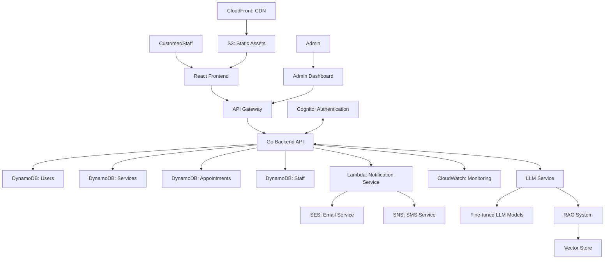
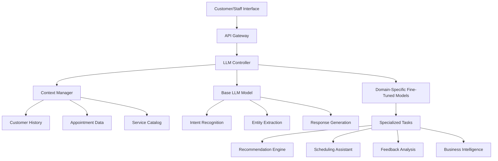
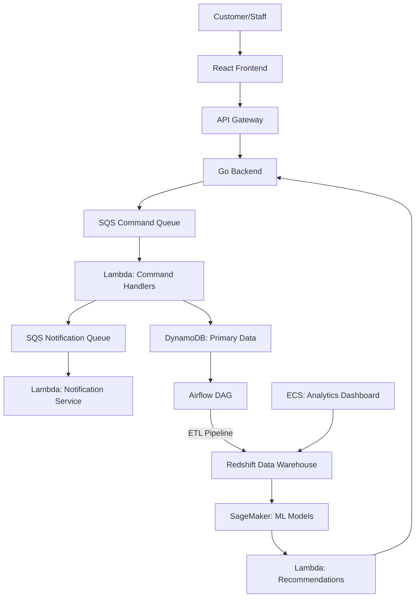

# Beauty Nail Shop Appointment Scheduler

## Project Overview

**Development Time: 30 Hours**

This advanced-level project creates a comprehensive web application for scheduling appointments at a nail beauty shop, enhanced with LLM-powered features for intelligent customer interaction and business optimization. The platform serves both customers and shop staff, featuring a modern React frontend and a robust Go backend, with AWS cloud services for scalability and reliability.

The system demonstrates professional-grade web development skills, practical business application development, and strategic AI integration to enhance customer experience and operational efficiency. It represents the culmination of skills in full-stack development, cloud architecture, and AI/ML integration within a practical business context.

## Development Timeline

| Phase | Time Estimate | Description |
|-------|---------------|-------------|
| System Architecture | 3 hours | Designing application architecture with Go backend and LLM integration points |
| Frontend Framework | 4 hours | Setting up React frontend with styled components and responsive design |
| Go Backend API | 5 hours | Developing Go backend with Gin/Echo framework and efficient scheduling logic |
| Database Design | 2 hours | Implementing database models for services, appointments, users, and staff |
| Authentication | 2 hours | Creating secure user authentication and role-based permissions |
| Appointment Engine | 3 hours | Building core scheduling functionality with conflict prevention |
| LLM Integration | 4 hours | Implementing AI-powered features (chatbot, recommendations, text analysis) |
| Admin Dashboard | 3 hours | Developing staff interface for appointment management |
| Customer Portal | 3 hours | Creating customer-facing booking and profile management |
| Testing & Refinement | 1 hour | Comprehensive testing and performance optimization |

## Architecture



## Technology Stack

### Frontend
- **React**: Component-based UI library
- **Redux**: State management
- **Styled Components**: Component styling
- **Material UI**: UI component library
- **Axios**: HTTP client
- **React Router**: Client-side routing
- **Formik**: Form handling with validation
- **React Calendar**: For date/time selection
- **React Testing Library**: Component testing

### Backend (Go)
- **Go (Golang)**: Backend programming language
- **Gin/Echo**: Web framework for Go
- **JWT-Go**: Authentication token handling
- **Go-validator**: Input validation
- **GORM**: ORM for database interactions
- **AWS SDK for Go**: AWS services integration
- **Go-redis**: Redis client for caching
- **Testify**: Testing framework
- **Zap/Logrus**: Structured logging

### AI/ML Components
- **OpenAI API/Self-hosted LLM**: Base language model
- **LangChain/LlamaIndex**: LLM application framework
- **Pinecone/Weaviate**: Vector database for RAG system
- **Hugging Face Transformers**: For specialized ML tasks
- **Sentence Transformers**: For text embedding
- **spaCy/NLTK**: NLP preprocessing

### AWS Services
- **DynamoDB**: NoSQL database for users, appointments, and services
- **Lambda**: Serverless functions for notifications and AI processing
- **API Gateway**: REST API management
- **Cognito**: User authentication and management
- **S3**: Static asset storage
- **CloudFront**: Content delivery network
- **SES**: Email sending service
- **SNS**: SMS notification service
- **CloudWatch**: Monitoring and logging
- **SageMaker**: (Optional) For hosting custom ML models

### Additional Data & Analytics Technologies

- **Cassandra:** Distributed NoSQL database for high-volume, scalable storage of appointment, customer, and business data, as well as time-series analytics.
- **PostgreSQL:** Relational database for structured business data, advanced queries, and transactional integrity.
- **TAO (Graph Database):** Native graph database for modeling and querying complex relationships in customer preferences, staff schedules, and business insights.
- **Data Warehouse (Hive, ORC):** Scalable analytics and historical trend analysis using columnar storage and big data processing.
- **Scuba:** Real-time analytics and ad-hoc querying for monitoring business operations, system performance, and interactive dashboards.

### Development & Deployment
- **Docker**: Containerization for consistent environments
- **GitHub Actions**: CI/CD pipeline
- **GoReleaser**: Go build and release management
- **ESLint/Prettier**: Frontend code linting and formatting
- **GolangCI-lint**: Go code linting
- **AWS CDK**: Infrastructure as code

## Core Components

### 1. Customer Portal with AI Enhancement
- User registration and profile management
- AI-powered service recommendation based on customer history
- LLM-enhanced chatbot for answering questions and booking assistance
- Intelligent appointment booking with natural language processing
- Personalized notifications and reminders
- Virtual nail design preview using text-to-image generation

### 2. Go Backend Architecture
- RESTful API built with Gin/Echo framework
- Clean domain-driven design with separation of concerns:
  - Handlers (API endpoints)
  - Services (Business logic)
  - Repositories (Data access)
  - Models (Data structures)
- Middleware for authentication, logging, and error handling
- Efficient concurrency handling for appointment scheduling
- Integration with AWS services via SDK for Go
- LLM service communication via gRPC or REST

### 3. AI-Powered Features

#### Intelligent Customer Service Chatbot
- Responds to FAQs about services, pricing, and policies
- Guides booking process with conversational interface
- Connects to appointment database for real-time availability checking
- Maintains context across conversation sessions
- Handles basic appointment modifications

#### Personalized Service Recommendations
- Analyzes customer history to suggest relevant services
- Recommends trending nail designs based on preferences
- Identifies complementary services based on selected treatments
- Adapts recommendations based on season and upcoming events

#### Smart Appointment Scheduling
- Processes natural language scheduling requests
- Handles complex constraints for group bookings
- Suggests optimal time slots based on staff availability
- Provides intelligent rescheduling options during busy periods

#### Automated Communication
- Generates personalized confirmation messages
- Creates tailored care instructions based on services received
- Produces natural-sounding follow-up communications
- Customizes promotional content based on customer preferences

#### Business Intelligence
- Provides natural language querying of business data
- Generates insights and trend reports automatically
- Forecasts busy periods and suggests staffing adjustments
- Identifies opportunities for service promotion

### 4. LLM Integration Architecture



## Implementation Examples

### 1. Go Appointment Scheduling Service

```go
package service

import (
    "errors"
    "time"
    "strings"

    "beauty-nail-shop/model"
    "beauty-nail-shop/repository"

    "github.com/aws/aws-sdk-go-v2/aws"
)

type AppointmentService struct {
    appointmentRepo repository.AppointmentRepository
    staffRepo       repository.StaffRepository
    serviceRepo     repository.ServiceRepository
}

func NewAppointmentService(
    appointmentRepo repository.AppointmentRepository,
    staffRepo repository.StaffRepository,
    serviceRepo repository.ServiceRepository,
) *AppointmentService {
    return &AppointmentService{
        appointmentRepo: appointmentRepo,
        staffRepo:       staffRepo,
        serviceRepo:     serviceRepo,
    }
}

type AvailableSlot struct {
    StaffID       string   `json:"staffId"`
    StaffName     string   `json:"staffName"`
    AvailableSlots []string `json:"availableSlots"`
}

func (s *AppointmentService) CheckAvailability(date string, serviceID string, staffID *string) ([]AvailableSlot, error) {
    // Get service duration
    service, err := s.serviceRepo.GetByID(serviceID)
    if err != nil {
        return nil, err
    }

    // Get staff members
    var staffMembers []model.Staff
    if staffID != nil {
        staff, err := s.staffRepo.GetByID(*staffID)
        if err != nil {
            return nil, err
        }
        staffMembers = []model.Staff{staff}
    } else {
        staffMembers, err = s.staffRepo.GetBySkill(service.RequiredStaffSkill)
        if err != nil {
            return nil, err
        }
    }

    availableSlots := make([]AvailableSlot, 0, len(staffMembers))

    for _, staff := range staffMembers {
        // Parse date and get day of week
        parsedDate, err := time.Parse("2006-01-02", date)
        if err != nil {
            return nil, err
        }

        dayOfWeek := parsedDate.Weekday().String()
        dayOfWeek = strings.ToLower(dayOfWeek)

        // Check if staff works this day
        schedule, exists := staff.Schedule[dayOfWeek]
        if !exists {
            continue // Staff doesn't work this day
        }

        // Check if staff is on time off
        isTimeOff := false
        for _, period := range staff.TimeOff {
            startDate, err := time.Parse("2006-01-02", period.Start)
            if err != nil {
                continue
            }

            endDate, err := time.Parse("2006-01-02", period.End)
            if err != nil {
                continue
            }

            if !parsedDate.Before(startDate) && !parsedDate.After(endDate) {
                isTimeOff = true
                break
            }
        }

        if isTimeOff {
            continue // Staff is on time off
        }

        // Get existing appointments
        existingAppointments, err := s.appointmentRepo.GetByStaffAndDate(staff.ID, date)
        if err != nil {
            return nil, err
        }

        // Calculate available slots
        slots := s.calculateAvailableTimeSlots(
            schedule.Start,
            schedule.End,
            schedule.Breaks,
            existingAppointments,
            service.Duration,
        )

        availableSlots = append(availableSlots, AvailableSlot{
            StaffID:        staff.ID,
            StaffName:      staff.Name,
            AvailableSlots: slots,
        })
    }

    return availableSlots, nil
}

// Additional methods omitted for brevity
```

### 2. LLM-Powered Chatbot Service

```go
package ai

import (
    "context"
    "encoding/json"

    "beauty-nail-shop/model"
    "beauty-nail-shop/repository"

    "github.com/aws/aws-sdk-go-v2/aws"
    "github.com/aws/aws-sdk-go-v2/service/lambda"
)

type ChatbotService struct {
    lambdaClient *lambda.Client
    serviceRepo  repository.ServiceRepository
    userRepo     repository.UserRepository
}

func NewChatbotService(
    lambdaClient *lambda.Client,
    serviceRepo repository.ServiceRepository,
    userRepo repository.UserRepository,
) *ChatbotService {
    return &ChatbotService{
        lambdaClient: lambdaClient,
        serviceRepo:  serviceRepo,
        userRepo:     userRepo,
    }
}

type ChatMessage struct {
    Role    string `json:"role"`
    Content string `json:"content"`
}

type ChatRequest struct {
    UserID      string        `json:"userId"`
    Messages    []ChatMessage `json:"messages"`
    MaxTokens   int           `json:"maxTokens"`
    Temperature float64       `json:"temperature"`
}

type ChatResponse struct {
    Message      ChatMessage          `json:"message"`
    Intent       string               `json:"intent"`
    Entities     map[string]string    `json:"entities"`
    ActionNeeded bool                 `json:"actionNeeded"`
    Action       map[string]interface{} `json:"action"`
}

func (s *ChatbotService) ProcessMessage(ctx context.Context, userID string, message string) (*ChatResponse, error) {
    // Get user context and history
    user, err := s.userRepo.GetByID(userID)
    if err != nil {
        return nil, err
    }

    // Prepare conversation history
    messages := []ChatMessage{
        {
            Role:    "system",
            Content: "You are a helpful assistant for a nail beauty shop. You can help with information about services, pricing, and scheduling appointments.",
        },
    }

    // Add retrieved conversation history
    // (In a real implementation, we would fetch this from a database)

    // Add current message
    messages = append(messages, ChatMessage{
        Role:    "user",
        Content: message,
    })

    // Prepare request to LLM Lambda function
    request := ChatRequest{
        UserID:      userID,
        Messages:    messages,
        MaxTokens:   500,
        Temperature: 0.7,
    }

    payload, err := json.Marshal(request)
    if err != nil {
        return nil, err
    }

    // Invoke Lambda function
    result, err := s.lambdaClient.Invoke(ctx, &lambda.InvokeInput{
        FunctionName: aws.String("beauty-nail-shop-llm-chatbot"),
        Payload:      payload,
    })
    if err != nil {
        return nil, err
    }

    // Parse response
    var response ChatResponse
    if err := json.Unmarshal(result.Payload, &response); err != nil {
        return nil, err
    }

    return &response, nil
}
```

### 3. AI-Powered Service Recommendation

```go
package ai

import (
    "context"
    "encoding/json"
    "time"

    "beauty-nail-shop/model"
    "beauty-nail-shop/repository"

    "github.com/aws/aws-sdk-go-v2/aws"
    "github.com/aws/aws-sdk-go-v2/service/sagemakerruntime"
)

type RecommendationService struct {
    sagemakerClient *sagemakerruntime.Client
    appointmentRepo repository.AppointmentRepository
    serviceRepo     repository.ServiceRepository
}

func NewRecommendationService(
    sagemakerClient *sagemakerruntime.Client,
    appointmentRepo repository.AppointmentRepository,
    serviceRepo repository.ServiceRepository,
) *RecommendationService {
    return &RecommendationService{
        sagemakerClient: sagemakerClient,
        appointmentRepo: appointmentRepo,
        serviceRepo:     serviceRepo,
    }
}

type RecommendationRequest struct {
    UserID           string   `json:"userId"`
    PastServiceIDs   []string `json:"pastServiceIds"`
    CurrentServiceID string   `json:"currentServiceId,omitempty"`
    Season           string   `json:"season"`
}

type RecommendationResponse struct {
    RecommendedServices []model.Service `json:"recommendedServices"`
    Reasoning           string          `json:"reasoning"`
}

func (s *RecommendationService) GetPersonalizedRecommendations(
    ctx context.Context,
    userID string,
    currentServiceID *string,
) (*RecommendationResponse, error) {
    // Get user's past appointments
    pastAppointments, err := s.appointmentRepo.GetCompletedByCustomer(userID)
    if err != nil {
        return nil, err
    }

    // Extract past service IDs
    pastServiceIDs := make([]string, 0, len(pastAppointments))
    for _, appointment := range pastAppointments {
        pastServiceIDs = append(pastServiceIDs, appointment.ServiceID)
    }

    // Determine current season
    currentTime := time.Now()
    month := currentTime.Month()
    var season string

    switch {
    case month >= 3 && month <= 5:
        season = "spring"
    case month >= 6 && month <= 8:
        season = "summer"
    case month >= 9 && month <= 11:
        season = "fall"
    default:
        season = "winter"
    }

    // Prepare recommendation request
    request := RecommendationRequest{
        UserID:         userID,
        PastServiceIDs: pastServiceIDs,
        Season:         season,
    }

    if currentServiceID != nil {
        request.CurrentServiceID = *currentServiceID
    }

    // Convert request to JSON
    requestJSON, err := json.Marshal(request)
    if err != nil {
        return nil, err
    }

    // Call SageMaker endpoint
    result, err := s.sagemakerClient.InvokeEndpoint(ctx, &sagemakerruntime.InvokeEndpointInput{
        EndpointName: aws.String("beauty-nail-shop-recommendation"),
        ContentType:  aws.String("application/json"),
        Body:         requestJSON,
    })
    if err != nil {
        return nil, err
    }

    // Parse the response
    var recommendationIDs struct {
        ServiceIDs []string `json:"serviceIds"`
        Reasoning  string   `json:"reasoning"`
    }

    if err := json.Unmarshal(result.Body, &recommendationIDs); err != nil {
        return nil, err
    }

    // Fetch the full service details
    recommendedServices := make([]model.Service, 0, len(recommendationIDs.ServiceIDs))
    for _, id := range recommendationIDs.ServiceIDs {
        service, err := s.serviceRepo.GetByID(id)
        if err != nil {
            continue
        }
        recommendedServices = append(recommendedServices, service)
    }

    return &RecommendationResponse{
        RecommendedServices: recommendedServices,
        Reasoning:           recommendationIDs.Reasoning,
    }, nil
}
```

## Database Models (Go Structs)

**User Model**
```go
type User struct {
    ID                   string    `json:"id" gorm:"primaryKey"`
    Email                string    `json:"email" gorm:"uniqueIndex"`
    Name                 string    `json:"name"`
    Phone                string    `json:"phone"`
    PasswordHash         string    `json:"-"`
    Role                 string    `json:"role"` // customer, staff, admin
    NotificationPreference string  `json:"notificationPreference"`
    FavoriteServices     []string  `json:"favoriteServices" gorm:"-"`
    PreferredStaff       []string  `json:"preferredStaff" gorm:"-"`
    Created              time.Time `json:"created"`
    LastLogin            time.Time `json:"lastLogin"`
}
```

**Service Model**
```go
type Service struct {
    ID                string  `json:"id" gorm:"primaryKey"`
    Name              string  `json:"name"`
    Description       string  `json:"description"`
    Duration          int     `json:"duration"` // in minutes
    Price             float64 `json:"price"`
    Category          string  `json:"category"`
    Image             string  `json:"image"`
    Active            bool    `json:"active"`
    RequiredStaffSkill string  `json:"requiredStaffSkill"`
}
```

**Appointment Model**
```go
type Appointment struct {
    ID            string    `json:"id" gorm:"primaryKey"`
    CustomerID    string    `json:"customerId"`
    StaffID       string    `json:"staffId"`
    ServiceID     string    `json:"serviceId"`
    Date          string    `json:"date"` // YYYY-MM-DD
    StartTime     string    `json:"startTime"` // HH:MM
    EndTime       string    `json:"endTime"` // HH:MM
    Status        string    `json:"status"` // scheduled, completed, cancelled, no-show
    Notes         string    `json:"notes"`
    Created       time.Time `json:"created"`
    LastUpdated   time.Time `json:"lastUpdated"`
}
```

**Staff Model**
```go
type TimeBlock struct {
    Start string `json:"start"`
    End   string `json:"end"`
}

type DaySchedule struct {
    Start  string      `json:"start"`
    End    string      `json:"end"`
    Breaks []TimeBlock `json:"breaks"`
}

type TimeOff struct {
    Start  string `json:"start"`
    End    string `json:"end"`
    Reason string `json:"reason"`
}

type Staff struct {
    ID       string                `json:"id" gorm:"primaryKey"`
    UserID   string                `json:"userId"`
    Name     string                `json:"name"`
    Position string                `json:"position"`
    Bio      string                `json:"bio"`
    Photo    string                `json:"photo"`
    Skills   []string              `json:"skills" gorm:"-"`
    Schedule map[string]DaySchedule `json:"schedule" gorm:"-"` // day -> schedule
    TimeOff  []TimeOff             `json:"timeOff" gorm:"-"`
}
```

## Use Cases

### 1. Customer Books an Appointment with AI Assistance

```
1. Customer navigates to the website and logs in
2. Customer asks the chatbot: "I'd like to get a gel manicure next Friday afternoon"
3. LLM-powered chatbot:
   - Extracts intent (appointment booking)
   - Identifies entities (service type: gel manicure, date: next Friday, time period: afternoon)
   - Checks service availability and staff schedules
   - Responds: "I can book you for a gel manicure next Friday. Emma and Jessica are available between 2:00 PM and 5:00 PM. Which technician and time would you prefer?"
4. Customer selects Jessica at 3:00 PM
5. Chatbot confirms details and completes booking
6. System sends a personalized confirmation email with care instructions specific to gel manicures
7. LLM-powered recommendation engine suggests a complementary service: "Many customers who get gel manicures also enjoy our paraffin hand treatment. Would you like to add this for $15?"
8. System schedules automatic reminder 24 hours before appointment
```

### 2. Staff Uses AI-Enhanced Dashboard

```
1. Nail technician logs into staff dashboard
2. Views today's appointment calendar with AI-generated summaries of customer preferences
3. Uses natural language query: "Show me my busiest days next month"
4. LLM processes request and displays visualized data of booking patterns
5. After completing a service, enters customer feedback
6. AI automatically analyzes feedback for sentiment and key issues
7. System suggests personalized follow-up message based on services provided
8. Staff approves message which is scheduled for sending in 3 days
```

### 3. Business Owner Analyzes Operations with AI Insights

```
1. Owner logs into admin dashboard
2. Reviews AI-generated weekly business summary highlighting:
   - Popular services and emerging trends
   - Staff utilization and efficiency metrics
   - Customer retention patterns
   - Recommendations for schedule optimization
3. Uses natural language query: "What services should we promote next month?"
4. LLM analyzes historical data, seasonal trends, and industry patterns
5. System provides recommendations with supporting data visualizations
6. Owner implements suggested pricing and scheduling adjustments
7. AI monitors impact of changes and provides ongoing optimization suggestions
```

## Project Structure

```
beauty-nail-shop/
├── frontend/                  # React frontend application
│   ├── public/                # Static assets
│   ├── src/                   # React source code
│   │   ├── components/        # UI components
│   │   ├── pages/             # Application pages
│   │   ├── hooks/             # Custom React hooks
│   │   ├── context/           # React context providers
│   │   ├── redux/             # Redux state management
│   │   ├── services/          # API service calls
│   │   ├── utils/             # Utility functions
│   │   └── App.js             # Main application
│   └── package.json           # Frontend dependencies
├── backend/                   # Go backend
│   ├── cmd/                   # Application entry points
│   │   └── api/               # API server
│   │       └── main.go        # Main application
│   ├── internal/              # Internal packages
│   │   ├── api/               # API handlers
│   │   │   ├── appointment.go # Appointment endpoints
│   │   │   ├── service.go     # Service endpoints
│   │   │   ├── user.go        # User endpoints
│   │   │   └── staff.go       # Staff endpoints
│   │   ├── model/             # Data models
│   │   ├── repository/        # Data access layer
│   │   │   ├── dynamodb/      # DynamoDB implementations
│   │   │   └── mock/          # Mock implementations for testing
│   │   └── service/           # Business logic
│   │       ├── appointment.go # Appointment service
│   │       ├── notification.go # Notification service
│   │       └── ai/            # AI integration services
│   │           ├── chatbot.go # Chatbot service
│   │           ├── recommendation.go # Recommendation service
│   │           └── analysis.go # Feedback analysis service
│   ├── pkg/                   # Public packages
│   │   ├── auth/              # Authentication utilities
│   │   ├── config/            # Configuration handling
│   │   └── logger/            # Logging utilities
│   ├── test/                  # Integration tests
│   └── go.mod                 # Go module definition
├── ai/                        # AI/ML components
│   ├── lambda/                # Lambda function code
│   │   ├── chatbot/           # Chatbot function
│   │   ├── recommendation/    # Recommendation function
│   │   └── notification/      # Smart notification function
│   ├── models/                # ML model definitions
│   ├── data/                  # Training data
│   └── notebooks/             # Jupyter notebooks for model development
├── infrastructure/            # Infrastructure as code
│   ├── cdk/                   # AWS CDK stack definitions
│   └── terraform/             # Terraform configurations (alternative)
├── scripts/                   # Utility scripts
│   ├── seed.go                # Database seeding
│   ├── deploy.sh              # Deployment script
│   └── backup.sh              # Database backup
├── docs/                      # Documentation
│   ├── api/                   # API documentation
│   └── user/                  # User guides
├── docker-compose.yml         # Docker composition for local development
└── README.md                  # Project documentation
```

## Local Development Setup

### Prerequisites
- Go 1.19+
- Node.js 16+
- npm or yarn
- Docker and Docker Compose
- AWS CLI configured with appropriate credentials

### Installation

1. Clone the repository:
```bash
git clone <repository-url>
cd beauty-nail-shop
```

2. Set up the Go backend:
```bash
cd backend
go mod tidy
```

3. Install frontend dependencies:
```bash
cd ../frontend
npm install
```

4. Set up environment variables:
```bash
cp .env.example .env
# Edit .env with your configuration
```

5. Start the development servers:
```bash
# Start backend (from backend directory)
cd ../backend
go run cmd/api/main.go

# Start frontend (from frontend directory)
cd ../frontend
npm start
```

6. Access the application:
- Frontend: http://localhost:3000
- Backend API: http://localhost:8080

## Deployment to AWS

### Infrastructure Deployment

1. Deploy the infrastructure using AWS CDK:
```bash
cd infrastructure/cdk
npm install
cdk deploy
```

### Application Deployment

1. Build the frontend:
```bash
cd frontend
npm run build
```

2. Build and deploy the Go backend:
```bash
cd ../backend
GOOS=linux GOARCH=amd64 go build -o main cmd/api/main.go
zip deployment.zip main
# Deploy using appropriate AWS service (ECS, Elastic Beanstalk, etc.)
```

3. Deploy Lambda functions:
```bash
cd ../ai/lambda
# Package and deploy each Lambda function
```

## AI/LLM Implementation Strategy

### Phase 1: MVP with Basic AI Integration
- Implement rule-based chatbot with predefined templates
- Add simple recommendation system based on service categories
- Establish API endpoints for LLM integration

### Phase 2: Enhanced LLM Features
- Integrate full LLM capabilities via OpenAI API or self-hosted models
- Implement retrieval-augmented generation (RAG) for accurate service information
- Add context-aware conversation handling with history management
- Develop personalized recommendation engine using customer history

### Phase 3: Advanced AI Features
- Deploy domain-specific fine-tuned models for nail industry language
- Implement virtual nail design preview with text-to-image generation
- Add sophisticated business intelligence with natural language querying
- Create automated A/B testing for notification optimization

## Limitations

- Initial version focuses on core scheduling without payment processing
- Calendar view limited to 3 months in advance
- SMS notifications limited by AWS SNS regional availability
- LLM generation quality dependent on model selection and fine-tuning
- AI recommendations require sufficient historical data to be effective
- Virtual nail design preview limited by image generation capabilities
- No multi-location support in initial version

## Enhanced Architecture (Learning Extensions)

This project has been extended with enterprise data processing and analytics capabilities to demonstrate a production-grade appointment scheduling platform.

### Enhanced Architecture Diagram



### Additional Technology Stack

- **AWS SQS**: Enables decoupled, asynchronous communication between system components
- **AWS Redshift**: Business intelligence data warehouse for appointment analytics
- **Apache Airflow**: Orchestrates data workflows and business reporting processes
- **Enhanced ML Capabilities**: Advanced prediction models for business optimization
- **Docker & Docker Compose**: Containerizes all services (frontend, backend, ML, Airflow, LocalStack, Redshift emulation, etc.) for easy local development and deployment

### Docker Implementation

- Multi-stage Dockerfiles for optimized builds of each service (frontend, backend, ML, Airflow, etc.)
- Docker Compose configuration to spin up the entire stack locally, including LocalStack for AWS emulation, PostgreSQL for Redshift, and Airflow
- Volume mounts for persistent data and configuration
- Health checks for service monitoring
- GPU support for ML containers (if available)

## Future Enhancements

1. **Payment Processing**: Integrate with payment gateways for deposits and full payments
2. **Multi-modal LLM**: Add image understanding for nail style recognition and inspiration
3. **Virtual Try-On**: AR-based nail color and design visualization
4. **Voice Interface**: Voice-based appointment booking and information queries
5. **Multi-location Support**: Expand system to handle multiple shop locations
6. **Advanced Analytics**: Detailed AI-driven forecasting and business optimization
7. **Staff Performance Metrics**: AI-powered evaluation of technician efficiency and customer satisfaction
8. **Loyalty Program**: Smart rewards system with personalized incentives
9. **Inventory Management**: Predictive inventory management tied to scheduled services
10. **Native Mobile Apps**: Dedicated applications for customers and staff

## License

This project is licensed under the MIT License - see the LICENSE file for details.

## Acknowledgments

- OpenAI/Anthropic for foundation LLM models
- AWS for cloud infrastructure and services
- Go and React communities for excellent documentation and packages
- Open-source AI and ML frameworks
- Nail salon industry experts for domain knowledge and requirements input
