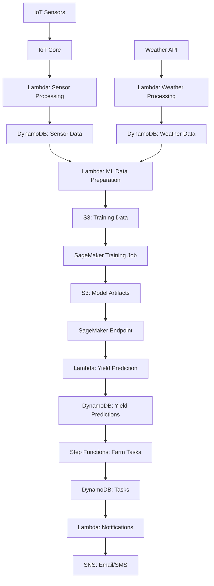

# OrchardHub – Smart Orchard Management Platform

## Table of Contents

- [Project Overview](#project-overview)
- [Phased Learning Roadmap](#phased-learning-roadmap)
  - [Phase 1: Core Platform Development](#phase-1-core-platform-development-10-11-hours)
  - [Phase 2: Enhanced Features & ML Integration](#phase-2-enhanced-features--ml-integration-12-13-hours)
  - [Phase 3: Advanced Capabilities & IoT Integration](#phase-3-advanced-capabilities--iot-integration-10-11-hours)
- [Development Timeline](#development-timeline)
- [Deep Dive: Data Design for OrchardHub](#deep-dive-data-design-for-orchardhub)
  - [Core Data Models (Go Structs)](#1-core-data-models-go-structs)
  - [Database Schema (DynamoDB)](#2-database-schema-dynamodb)
  - [Data Processing Pipeline](#3-data-processing-pipeline)
  - [LLM Prompting Strategy](#4-llm-prompting-strategy)
  - [API Contract](#5-api-contract)
  - [Data for Visualizations](#6-data-for-visualizations)
  - [Storage Design for Files](#7-storage-design-for-files)
  - [React Component Data Flow](#8-react-component-data-flow)
  - [IoT Data Flow](#9-iot-data-flow)
  - [Data Evolution Considerations](#10-data-evolution-considerations)
- [Architecture](#architecture)
- [Technology Stack](#technology-stack)
- [Core Components](#core-components)
- [Use Cases](#use-cases)
- [Local Development Setup](#local-development-setup)
- [Deployment to AWS](#deployment-to-aws)
- [Project Structure](#project-structure)
- [Enhanced Architecture (Learning Extensions)](#enhanced-architecture-learning-extensions)
- [Future Enhancements](#future-enhancements)
- [Limitations](#limitations)
- [License](#license)
- [Acknowledgments](#acknowledgments)

## Project Overview

**Development Time:** 34 Hours
**Complexity Level:** Advanced

OrchardHub is a comprehensive web platform for orchard farms, serving both customers and farm management. It integrates modern web technologies with AI-powered features to enhance the orchard experience, optimize operations, and provide valuable insights for business decision-making.

The platform demonstrates the integration of multiple advanced technologies including React frontend, Go backend, IoT sensor integration, ML-based predictions, and LLM-powered features, all within a cloud-native AWS architecture.

---

## Phased Learning Roadmap

To make this project approachable despite its complexity, the development is split into three progressive phases, each building on the previous one with clear deliverables:

---

### Phase 1: Core Platform Development (10-11 hours)

#### TODO List

- [ ] **Project Setup & Architecture**
  - [ ] Design overall system architecture
  - [ ] Create project structure with directories for frontend, backend, and infrastructure
  - [ ] Set up Go modules with `go mod init orchardhub`
  - [ ] Configure basic Gin web framework
  - [ ] Set up React application with Create React App
  - [ ] Implement basic Docker setup for development

- [ ] **Frontend Framework**
  - [ ] Implement responsive layout with Tailwind CSS
  - [ ] Create core components (Header, Footer, Navigation)
  - [ ] Set up React Router with main routes
  - [ ] Create product catalog and listing pages
  - [ ] Implement basic farm map visualization
  - [ ] Add authentication UI (login/signup)

- [ ] **Go Backend API**
  - [ ] Implement user authentication with JWT
  - [ ] Create RESTful API for products and inventory
  - [ ] Set up middleware for logging, CORS, and error handling
  - [ ] Implement file upload for product images
  - [ ] Add validation for API requests
  - [ ] Create initial admin endpoints

- [ ] **Database Design & Integration**
  - [ ] Design DynamoDB schemas for products, users, and inventory
  - [ ] Implement repository pattern for data access
  - [ ] Set up LocalStack for local AWS emulation
  - [ ] Create seed data for development
  - [ ] Implement basic caching with Redis

**Phase 1 Deliverable:**
A functional web platform with product catalog, basic inventory management, user authentication, and admin interface. The system will use a serverless architecture with Go APIs and React frontend.

---

### Phase 2: Enhanced Features & ML Integration (12-13 hours)

#### TODO List

- [ ] **Customer Portal Enhancements**
  - [ ] Build online ordering system with cart and checkout
  - [ ] Implement order tracking and history
  - [ ] Create visit reservation calendar
  - [ ] Add user profiles with preferences
  - [ ] Implement product search and filtering
  - [ ] Add product recommendations

- [ ] **Farm Management System**
  - [ ] Develop harvest planning tools
  - [ ] Create inventory forecasting system
  - [ ] Implement worker scheduling interface
  - [ ] Build equipment management system
  - [ ] Add task management and assignment
  - [ ] Create reporting and dashboard for farm operations

- [ ] **ML Integration**
  - [ ] Set up data processing pipeline for historical harvest data
  - [ ] Implement XGBoost models for yield prediction
  - [ ] Create anomaly detection for pest/disease identification
  - [ ] Set up SageMaker endpoints for model inference
  - [ ] Build Step Functions workflow for batch processing
  - [ ] Implement model retraining pipeline

- [ ] **Weather Integration**
  - [ ] Connect to external weather API
  - [ ] Build data processing Lambda for weather forecasts
  - [ ] Create weather-based recommendations
  - [ ] Implement alerts for extreme weather conditions
  - [ ] Add visualization of weather patterns

**Phase 2 Deliverable:**
An enhanced platform with ML-powered predictions, complete customer portal, sophisticated farm management tools, and weather integration. The system will use SageMaker for ML model hosting and DynamoDB for scalable data storage.

---

### Phase 3: Advanced Capabilities & IoT Integration (10-11 hours)

#### TODO List

- [ ] **IoT Integration**
  - [ ] Set up AWS IoT Core for sensor data
  - [ ] Implement sensor data processing Lambda
  - [ ] Create real-time dashboards for sensor readings
  - [ ] Build alert system for critical conditions
  - [ ] Implement automated irrigation recommendations
  - [ ] Develop mobile app for field readings

- [ ] **Analytics Dashboard**
  - [ ] Create comprehensive business intelligence dashboard
  - [ ] Implement D3.js/Recharts visualizations
  - [ ] Build customer behavior analytics
  - [ ] Create yield and revenue forecasting
  - [ ] Add resource utilization optimization
  - [ ] Implement natural language generation for insights

- [ ] **LLM-Enhanced Features**
  - [ ] Integrate OpenAI API/LangChain
  - [ ] Implement chatbot for customer support
  - [ ] Create content generation for product descriptions
  - [ ] Build natural language querying of farm data
  - [ ] Implement personalized recommendations
  - [ ] Add automated response to customer inquiries

- [ ] **System Optimization & Testing**
  - [ ] Implement caching strategy
  - [ ] Add horizontal scaling for APIs
  - [ ] Create monitoring and alerting
  - [ ] Perform load testing and optimization
  - [ ] Implement comprehensive test suite
  - [ ] Create CI/CD pipeline with GitHub Actions

**Phase 3 Deliverable:**
A complete, production-ready orchard management platform with IoT integration, advanced analytics, LLM-powered features, and optimized performance. The system will demonstrate a sophisticated integration of multiple AWS services within a serverless architecture.

---

**Learning Path Between Phases:**
- From Phase 1 to 2: Learn ML integration, advanced AWS services, farm management principles
- From Phase 2 to 3: Learn IoT integration, advanced analytics, LLM application development, and system optimization

**Development Timeline (6 Hours/Week):**
- Week 1: System Architecture & Frontend Framework (Phase 1)
- Week 2: Backend API Core (Phase 1)
- Week 3: Database Setup & Customer Portal (Phase 1-2)
- Week 4: Farm Management & ML Preparation (Phase 2)
- Week 5: ML Integration & IoT Framework (Phase 2-3)
- Week 6: Analytics Dashboard & Advanced AI (Phase 3)

---

## Development Timeline

| Phase | Time Estimate | Description |
|-------|---------------|-------------|
| System Architecture | 3 hours | Designing core architecture, AWS infrastructure planning |
| Frontend Framework | 4 hours | Building React application with Tailwind CSS and component structure |
| Backend APIs | 5 hours | Creating Go services, RESTful endpoints, and authentication |
| Database & Data Modeling | 4 hours | Setting up DynamoDB, data models, and repository pattern |
| ML Integration | 6 hours | XGBoost models for yield prediction, SageMaker integration |
| IoT Sensor Integration | 4 hours | AWS IoT Core setup, sensor data processing pipeline |
| Analytics & Dashboards | 5 hours | Business intelligence dashboards, D3.js visualizations |
| LLM-Enhanced Features | 3 hours | Customer support chatbot, content generation, natural language querying |

---

## Deep Dive: Data Design for OrchardHub

### 1. Core Data Models (Go Structs)

```go
// Product represents farm produce available for sale
type Product struct {
    ID          string    `json:"id" dynamodbav:"id"`
    Name        string    `json:"name" dynamodbav:"name"`
    Category    string    `json:"category" dynamodbav:"category"` // fruit, vegetable, value-added
    Description string    `json:"description" dynamodbav:"description"`
    ImageURL    string    `json:"imageUrl" dynamodbav:"imageUrl"`
    Price       float64   `json:"price" dynamodbav:"price"`
    Unit        string    `json:"unit" dynamodbav:"unit"` // lb, each, dozen, etc.
    Organic     bool      `json:"organic" dynamodbav:"organic"`
    InSeason    bool      `json:"inSeason" dynamodbav:"inSeason"`
    SeasonStart string    `json:"seasonStart" dynamodbav:"seasonStart"` // MM-DD
    SeasonEnd   string    `json:"seasonEnd" dynamodbav:"seasonEnd"`     // MM-DD
    OrchardArea string    `json:"orchardArea" dynamodbav:"orchardArea"` // location in the orchard
    CreatedAt   time.Time `json:"createdAt" dynamodbav:"createdAt"`
    UpdatedAt   time.Time `json:"updatedAt" dynamodbav:"updatedAt"`
}

// Inventory tracks current produce quantities
type Inventory struct {
    ProductID      string    `json:"productId" dynamodbav:"productId"`
    Quantity       float64   `json:"quantity" dynamodbav:"quantity"`
    Unit           string    `json:"unit" dynamodbav:"unit"`
    LastHarvested  time.Time `json:"lastHarvested" dynamodbav:"lastHarvested"`
    NextHarvest    time.Time `json:"nextHarvest" dynamodbav:"nextHarvest"`
    Status         string    `json:"status" dynamodbav:"status"` // available, low, out-of-stock
    ReorderPoint   float64   `json:"reorderPoint" dynamodbav:"reorderPoint"`
    ForecastedYield float64  `json:"forecastedYield" dynamodbav:"forecastedYield"`
    UpdatedAt      time.Time `json:"updatedAt" dynamodbav:"updatedAt"`
}

// User represents system users (customers, staff, admins)
type User struct {
    ID              string    `json:"id" dynamodbav:"id"`
    Email           string    `json:"email" dynamodbav:"email"`
    Name            string    `json:"name" dynamodbav:"name"`
    Role            string    `json:"role" dynamodbav:"role"` // customer, staff, admin
    PasswordHash    string    `json:"-" dynamodbav:"passwordHash"`
    Phone           string    `json:"phone" dynamodbav:"phone"`
    Address         Address   `json:"address" dynamodbav:"address"`
    Preferences     []string  `json:"preferences" dynamodbav:"preferences"` // product preferences
    NotificationPref string   `json:"notificationPref" dynamodbav:"notificationPref"` // email, sms, both
    LastLogin       time.Time `json:"lastLogin" dynamodbav:"lastLogin"`
    CreatedAt       time.Time `json:"createdAt" dynamodbav:"createdAt"`
}

// Address stores location information
type Address struct {
    Street  string `json:"street" dynamodbav:"street"`
    City    string `json:"city" dynamodbav:"city"`
    State   string `json:"state" dynamodbav:"state"`
    ZipCode string `json:"zipCode" dynamodbav:"zipCode"`
    Country string `json:"country" dynamodbav:"country"`
}

// Order represents a customer purchase
type Order struct {
    ID            string         `json:"id" dynamodbav:"id"`
    CustomerID    string         `json:"customerId" dynamodbav:"customerId"`
    Items         []OrderItem    `json:"items" dynamodbav:"items"`
    Total         float64        `json:"total" dynamodbav:"total"`
    Status        string         `json:"status" dynamodbav:"status"` // pending, processing, shipped, delivered
    PaymentStatus string         `json:"paymentStatus" dynamodbav:"paymentStatus"`
    DeliveryMethod string        `json:"deliveryMethod" dynamodbav:"deliveryMethod"` // pickup, delivery
    PickupTime    *time.Time     `json:"pickupTime,omitempty" dynamodbav:"pickupTime,omitempty"`
    DeliveryAddress *Address     `json:"deliveryAddress,omitempty" dynamodbav:"deliveryAddress,omitempty"`
    CreatedAt     time.Time      `json:"createdAt" dynamodbav:"createdAt"`
    UpdatedAt     time.Time      `json:"updatedAt" dynamodbav:"updatedAt"`
}

// OrderItem represents an item within an order
type OrderItem struct {
    ProductID   string  `json:"productId" dynamodbav:"productId"`
    ProductName string  `json:"productName" dynamodbav:"productName"`
    Quantity    float64 `json:"quantity" dynamodbav:"quantity"`
    Unit        string  `json:"unit" dynamodbav:"unit"`
    Price       float64 `json:"price" dynamodbav:"price"`
    Subtotal    float64 `json:"subtotal" dynamodbav:"subtotal"`
}

// SensorData represents IoT sensor readings
type SensorData struct {
    SensorID      string    `json:"sensorId" dynamodbav:"sensorId"`
    OrchardAreaID string    `json:"orchardAreaId" dynamodbav:"orchardAreaId"`
    Type          string    `json:"type" dynamodbav:"type"` // soil_moisture, temperature, humidity
    Value         float64   `json:"value" dynamodbav:"value"`
    Unit          string    `json:"unit" dynamodbav:"unit"` // %, °C, etc.
    Timestamp     time.Time `json:"timestamp" dynamodbav:"timestamp"`
    Battery       int       `json:"battery" dynamodbav:"battery"` // battery level in %
}

// OrchardArea represents a section of the farm
type OrchardArea struct {
    ID          string    `json:"id" dynamodbav:"id"`
    Name        string    `json:"name" dynamodbav:"name"`
    Type        string    `json:"type" dynamodbav:"type"` // apples, berries, citrus, etc.
    Size        float64   `json:"size" dynamodbav:"size"` // in acres
    Location    GeoPoint  `json:"location" dynamodbav:"location"`
    Products    []string  `json:"products" dynamodbav:"products"` // product IDs grown in this area
    SensorIDs   []string  `json:"sensorIds" dynamodbav:"sensorIds"`
}

// GeoPoint represents geographic coordinates
type GeoPoint struct {
    Latitude  float64 `json:"latitude" dynamodbav:"latitude"`
    Longitude float64 `json:"longitude" dynamodbav:"longitude"`
}

// Task represents work to be done on the farm
type Task struct {
    ID          string    `json:"id" dynamodbav:"id"`
    Title       string    `json:"title" dynamodbav:"title"`
    Description string    `json:"description" dynamodbav:"description"`
    AreaID      string    `json:"areaId" dynamodbav:"areaId"`
    AssignedTo  []string  `json:"assignedTo" dynamodbav:"assignedTo"` // user IDs
    Priority    int       `json:"priority" dynamodbav:"priority"` // 1-5
    Status      string    `json:"status" dynamodbav:"status"` // pending, in-progress, completed
    DueDate     time.Time `json:"dueDate" dynamodbav:"dueDate"`
    CreatedAt   time.Time `json:"createdAt" dynamodbav:"createdAt"`
    UpdatedAt   time.Time `json:"updatedAt" dynamodbav:"updatedAt"`
}

// WeatherData represents weather forecasts and historical data
type WeatherData struct {
    Date        string  `json:"date" dynamodbav:"date"` // YYYY-MM-DD
    Temperature float64 `json:"temperature" dynamodbav:"temperature"` // in °C
    Humidity    float64 `json:"humidity" dynamodbav:"humidity"` // in %
    Rainfall    float64 `json:"rainfall" dynamodbav:"rainfall"` // in mm
    WindSpeed   float64 `json:"windSpeed" dynamodbav:"windSpeed"` // in km/h
    Conditions  string  `json:"conditions" dynamodbav:"conditions"` // sunny, cloudy, rainy
    Source      string  `json:"source" dynamodbav:"source"` // api name
}

// YieldPrediction represents ML model output for harvest forecasting
type YieldPrediction struct {
    ProductID     string    `json:"productId" dynamodbav:"productId"`
    OrchardAreaID string    `json:"orchardAreaId" dynamodbav:"orchardAreaId"`
    PredictedDate time.Time `json:"predictedDate" dynamodbav:"predictedDate"`
    PredictedYield float64  `json:"predictedYield" dynamodbav:"predictedYield"`
    Confidence    float64   `json:"confidence" dynamodbav:"confidence"` // 0.0-1.0
    Factors       []string  `json:"factors" dynamodbav:"factors"` // influencing factors
    GeneratedAt   time.Time `json:"generatedAt" dynamodbav:"generatedAt"`
}

// Visit represents a customer orchard visit booking
type Visit struct {
    ID          string    `json:"id" dynamodbav:"id"`
    CustomerID  string    `json:"customerId" dynamodbav:"customerId"`
    VisitType   string    `json:"visitType" dynamodbav:"visitType"` // tour, picking, event
    Date        time.Time `json:"date" dynamodbav:"date"`
    PartySize   int       `json:"partySize" dynamodbav:"partySize"`
    Status      string    `json:"status" dynamodbav:"status"` // booked, cancelled, completed
    SpecialRequests string `json:"specialRequests" dynamodbav:"specialRequests"`
    CreatedAt   time.Time `json:"createdAt" dynamodbav:"createdAt"`
}
```

### 2. Database Schema (DynamoDB)

- **Products Table**:
  - Partition Key: `id` (UUID)
  - GSI1: Partition Key: `category`, Sort Key: `name`
  - GSI2: Partition Key: `inSeason` (boolean), Sort Key: `name`

- **Inventory Table**:
  - Partition Key: `productId`
  - GSI1: Partition Key: `status`, Sort Key: `quantity`

- **Users Table**:
  - Partition Key: `id` (UUID)
  - GSI1: Partition Key: `email` (for lookups)
  - GSI2: Partition Key: `role`, Sort Key: `name`

- **Orders Table**:
  - Partition Key: `id` (UUID)
  - GSI1: Partition Key: `customerId`, Sort Key: `createdAt`
  - GSI2: Partition Key: `status`, Sort Key: `createdAt`

- **SensorData Table**:
  - Partition Key: `sensorId`
  - Sort Key: `timestamp`
  - GSI1: Partition Key: `orchardAreaId`, Sort Key: `timestamp`
  - GSI2: Partition Key: `type`, Sort Key: `timestamp`

- **OrchardAreas Table**:
  - Partition Key: `id` (UUID)
  - GSI1: Partition Key: `type`, Sort Key: `name`

- **Tasks Table**:
  - Partition Key: `id` (UUID)
  - GSI1: Partition Key: `areaId`, Sort Key: `dueDate`
  - GSI2: Partition Key: `status`, Sort Key: `dueDate`
  - GSI3: Partition Key: `assignedTo` (single user), Sort Key: `priority`

- **WeatherData Table**:
  - Partition Key: `date`

- **YieldPredictions Table**:
  - Partition Key: `productId`
  - Sort Key: `predictedDate`
  - GSI1: Partition Key: `orchardAreaId`, Sort Key: `predictedDate`

- **Visits Table**:
  - Partition Key: `id` (UUID)
  - GSI1: Partition Key: `customerId`, Sort Key: `date`
  - GSI2: Partition Key: `date`, Sort Key: `visitType`
  - GSI3: Partition Key: `status`, Sort Key: `date`

### 3. Data Processing Pipeline



#### ASCII Visualization

```
+----------------+        +---------------+
|  IoT Sensors   |------->|   IoT Core    |
+----------------+        +---------------+
                                 |
                                 v
+----------------+        +---------------+
| Weather API    |------->| Lambda: Data  |
+----------------+        | Processing    |
                          +---------------+
                                 |
                                 v
                          +---------------+
                          |   DynamoDB    |
                          +---------------+
                                 |
                                 v
+----------------+        +---------------+
| Historical     |------->| SageMaker ML  |
| Farm Data      |        | Pipeline      |
+----------------+        +---------------+
                                 |
                                 v
                          +---------------+
                          | Lambda: Yield |
                          | Prediction    |
                          +---------------+
                                 |
                                 v
+----------------+        +---------------+
| Farm Task      |<-------|  Step         |
| Generation     |        |  Functions    |
+----------------+        +---------------+
                                 |
                                 v
                          +---------------+
                          | Notifications |
                          | System        |
                          +---------------+
```

### 4. LLM Prompting Strategy

```go
// Crop Recommendation Prompt
const cropRecommendationPrompt = `
You are an agricultural AI expert specializing in orchard management.
Based on the following data, recommend optimal crops for planting in this specific orchard area.

Soil Data: {{.SoilData}}
Climate History: {{.ClimateHistory}}
Current Crops: {{.CurrentCrops}}
Adjacent Areas: {{.AdjacentAreas}}

Provide recommendations in the following JSON format:
{
  "recommendedCrops": [
    {
      "name": "string",
      "variety": "string",
      "confidence": float,
      "reasoningSummary": "string",
      "expectedYield": float,
      "estimatedMaturity": "string"
    }
  ],
  "rotationSuggestions": "string",
  "sustainabilityNotes": "string"
}
`

// Customer Support Prompt
const customerSupportPrompt = `
You are a helpful assistant for OrchardHub, an orchard farm that sells fresh produce and offers farm visits.
Respond to the customer query below in a friendly, helpful manner.

Available Products: {{.Products}}
Current Seasonal Items: {{.SeasonalItems}}
Visit Options: {{.VisitOptions}}
Farm Policies: {{.Policies}}

Customer Query: {{.Query}}

Respond conversationally but be specific about products, availability, and policies.
If you don't know something, suggest the customer contact the farm directly.
`
```

### 5. API Contract

#### Customer APIs

- **GET /api/products**: List all available products
- **GET /api/products/:id**: Get product details
- **GET /api/products/seasonal**: Get current seasonal products
- **GET /api/orchard/areas**: Get orchard areas for the map
- **GET /api/orchard/visits/availability**: Get available visit slots
- **POST /api/orchard/visits**: Book a visit
- **GET /api/orchard/visits/:id**: Get visit details
- **POST /api/orders**: Create a new order
- **GET /api/orders/:id**: Get order details
- **GET /api/orders/:id/status**: Get order status
- **GET /api/users/me**: Get current user profile
- **PUT /api/users/me**: Update user profile
- **POST /api/support/chat**: Send message to support chatbot

#### Farm Management APIs

- **GET /api/inventory**: List all inventory
- **GET /api/inventory/:productId**: Get inventory for specific product
- **PUT /api/inventory/:productId**: Update inventory
- **GET /api/tasks**: List all farm tasks
- **POST /api/tasks**: Create new task
- **PUT /api/tasks/:id**: Update task status
- **GET /api/tasks/assigned/:userId**: Get tasks assigned to a user
- **GET /api/sensors**: List all sensors
- **GET /api/sensors/:id/readings**: Get sensor readings
- **GET /api/sensors/area/:areaId**: Get all sensors in an area
- **GET /api/weather/forecast**: Get weather forecast
- **GET /api/predictions/yield**: Get yield predictions
- **POST /api/predictions/generate**: Generate new predictions

#### Admin APIs

- **GET /api/admin/users**: List all users
- **POST /api/admin/users**: Create new user
- **PUT /api/admin/users/:id**: Update user
- **GET /api/admin/analytics/sales**: Get sales analytics
- **GET /api/admin/analytics/visits**: Get visit analytics
- **GET /api/admin/analytics/inventory**: Get inventory analytics
- **GET /api/admin/system/logs**: Get system logs
- **POST /api/admin/system/backup**: Trigger system backup

### 6. Data for Visualizations

```go
// For orchard map visualization
type OrchardMapData struct {
    Areas []struct {
        ID       string    `json:"id"`
        Name     string    `json:"name"`
        Type     string    `json:"type"`
        Polygon  []GeoPoint `json:"polygon"`
        CropData struct {
            MainCrop     string  `json:"mainCrop"`
            PlantingDate string  `json:"plantingDate"`
            Health       float64 `json:"health"` // 0-1 scale
            NextHarvest  string  `json:"nextHarvest"`
        } `json:"cropData"`
        SensorData struct {
            MoistureLevels float64 `json:"moistureLevels"`
            Temperature    float64 `json:"temperature"`
            LastUpdated    string  `json:"lastUpdated"`
        } `json:"sensorData"`
    } `json:"areas"`
}

// For yield prediction visualization
type YieldForecastData struct {
    ProductID  string    `json:"productId"`
    ProductName string   `json:"productName"`
    TimePoints []string  `json:"timePoints"` // dates
    Predicted  []float64 `json:"predicted"`  // predicted yield
    Actual     []float64 `json:"actual"`     // actual yield (historical)
    LowerBound []float64 `json:"lowerBound"` // confidence interval
    UpperBound []float64 `json:"upperBound"` // confidence interval
}

// For sales analytics
type SalesAnalyticsData struct {
    TimePeriods []string   `json:"timePeriods"` // weeks/months
    Revenue     []float64  `json:"revenue"`
    ProductSales []struct {
        ProductID   string   `json:"productId"`
        ProductName string   `json:"productName"`
        Quantities  []float64 `json:"quantities"`
        Revenue     []float64 `json:"revenue"`
    } `json:"productSales"`
    TopProducts []struct {
        ProductID   string  `json:"productId"`
        ProductName string  `json:"productName"`
        Quantity    float64 `json:"quantity"`
        Revenue     float64 `json:"revenue"`
    } `json:"topProducts"`
}

// For sensor data visualization
type SensorTimeseriesData struct {
    SensorID  string    `json:"sensorId"`
    AreaName  string    `json:"areaName"`
    Type      string    `json:"type"`
    Unit      string    `json:"unit"`
    Timestamps []string  `json:"timestamps"`
    Values     []float64 `json:"values"`
    Thresholds struct {
        Low  float64 `json:"low"`
        High float64 `json:"high"`
    } `json:"thresholds"`
}
```

### 7. Storage Design for Files

```
/storage
  /products
    /{product-id}/
      - main.jpg
      - thumbnail.jpg
      - details.json
  /orchard
    /areas/
      /{area-id}/
        - map.geojson
        - overview.jpg
    /sensors/
      /{sensor-id}/
        - installation.jpg
        - calibration.json
  /users
    /{user-id}/
      - profile.jpg
      - preferences.json
  /reports
    /sales/
      - {YYYY-MM}.pdf
    /inventory/
      - {YYYY-MM}.pdf
    /predictions/
      - {YYYY-MM}.pdf
  /weather
    /{YYYY-MM-DD}/
      - forecast.json
      - actuals.json
  /ml
    /models/
      /{model-id}/
        - config.json
        - metrics.json
    /training/
      /{job-id}/
        - dataset.csv
        - results.json
```

### 8. React Component Data Flow

```mermaid
graph TD
    A[App Component] --> B[Header/Navigation]
    A --> C[Home Page]
    A --> D[Product Catalog]
    A --> E[Orchard Map]
    A --> F[Customer Dashboar
