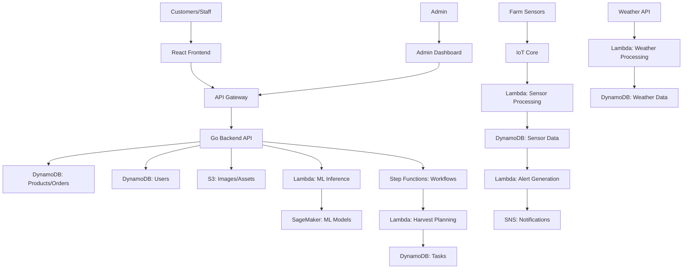

# OrchardHub – Smart Orchard Management Platform

## Project Overview

**Development Time:** 34 Hours
**Complexity Level:** Advanced

OrchardHub is a comprehensive web platform for orchard farms, serving both customers and farm management. It integrates modern web technologies with AI-powered features to enhance the orchard experience, optimize operations, and provide valuable insights for business decision-making.

---

## Key Objectives

- Create an attractive, responsive website for customers to learn about the orchard, products, and services
- Implement a sophisticated inventory and harvest management system for farm operators
- Develop an AI-powered crop forecasting and management tool using weather data and historical harvests
- Build a customer portal for ordering produce, scheduling orchard visits, and managing preferences
- Create a comprehensive analytics dashboard for business intelligence
- Implement IoT integration for farm sensors (soil moisture, temperature, etc.)

---

## Technology Stack

### Frontend
- **React** (with Redux/Context API)
- **Tailwind CSS/Material UI**
- **D3.js/Recharts**
- **React Router**
- **Mapbox/Leaflet**

### Backend (Go)
- **Go (Golang)** with **Gin/Echo**
- **JWT-Go**, **Go-validator**, **GORM**
- **AWS SDK for Go**

### AI/ML Components
- **LLM Integration** (OpenAI API, LangChain/LlamaIndex)
- **XGBoost** for crop yield prediction and anomaly detection
- **Weather API Integration**

### AWS Services
- **DynamoDB**, **Lambda**, **S3**, **SageMaker**, **Step Functions**
- **CloudFront**, **CloudWatch**, **API Gateway**, **Cognito**

### Data Storage & Processing
- **DynamoDB**, **Neptune** (optional), **Redis**, **PostgreSQL**

### DevOps & Infrastructure
- **Docker & Docker Compose**
- **LocalStack**
- **GitHub Actions**
- **AWS CDK**

---

## Core Components

### 1. Customer Portal
- Interactive orchard map
- Seasonal produce calendar
- Online ordering system
- Visit reservation system
- Educational content
- Event booking

### 2. Farm Management System
- Inventory tracking
- Harvest planning and scheduling
- Worker assignment
- Equipment/resource management
- Pest/disease tracking with ML
- Automated task generation

### 3. AI-Powered Crop Management
- Weather data integration
- Harvest yield forecasting (XGBoost)
- Anomaly detection
- Optimal harvesting time predictions
- Natural language querying
- LLM-generated content

### 4. IoT Integration
- Soil moisture/temperature sensor data
- Automated irrigation recommendations
- Weather station integration
- Mobile sensor readings

### 5. Analytics Dashboard
- Real-time sales/inventory visualization
- Customer behavior analysis
- Seasonal trend identification
- Resource optimization
- Predictive analytics
- Natural language business insights

---

## Architecture Diagram

---

## Development Timeline (6 Hours/Week)

| Week | Tasks | Deliverables |
|------|-------|-------------|
| 1 | System Architecture (3h), Frontend Setup (3h) | Design docs, React scaffold |
| 2 | Frontend Setup (1h), Backend API Core (5h) | Responsive layout, API skeleton |
| 3 | Backend API (1h), Database Setup (2h), Customer Portal (3h) | Data models, product catalog |
| 4 | Customer Portal (1h), Farm Management (4h), ML Prep (1h) | Ordering, inventory, ML pipeline |
| 5 | ML Integration (2h), IoT Framework (3h), Analytics Dashboard (1h) | Crop prediction, sensor data |
| 6 | Analytics Dashboard (3h), Advanced AI (2h), Testing (1h) | BI dashboard, LLM features, QA |

---

## Unique Features

- Visual orchard digital twin
- AI-powered harvest prediction
- LLM-enhanced customer support
- Precision farming recommendations
- Dynamic pricing model
- Community marketplace

---

## Implementation Strategy

**Phase 1:** Core platform (website, inventory, customer accounts)
**Phase 2:** Enhanced features (ML, IoT, advanced ordering, management tools)
**Phase 3:** Advanced capabilities (digital twin, analytics, automation, AI)

---

## License

This project is licensed under the MIT License.

---

## Acknowledgments

- OpenAI, AWS, Go and React communities, and the broader open-source ecosystem.
